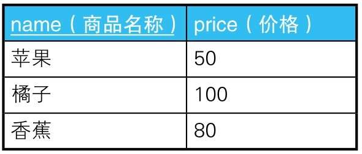
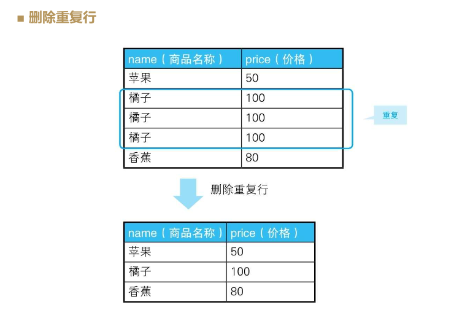
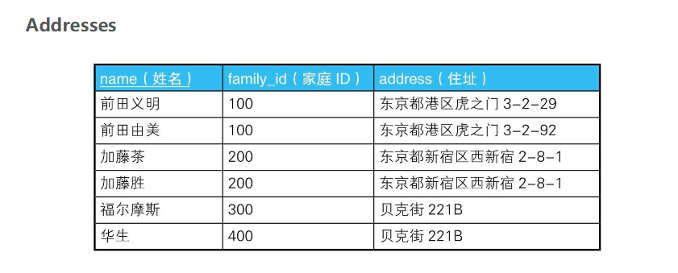
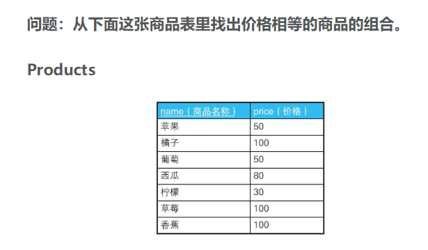
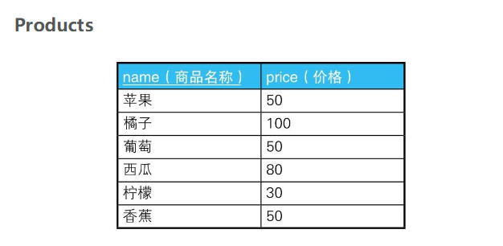
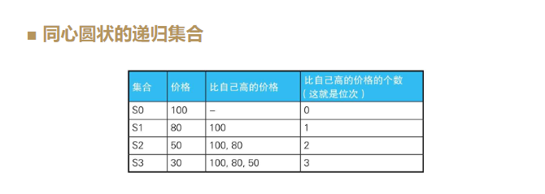
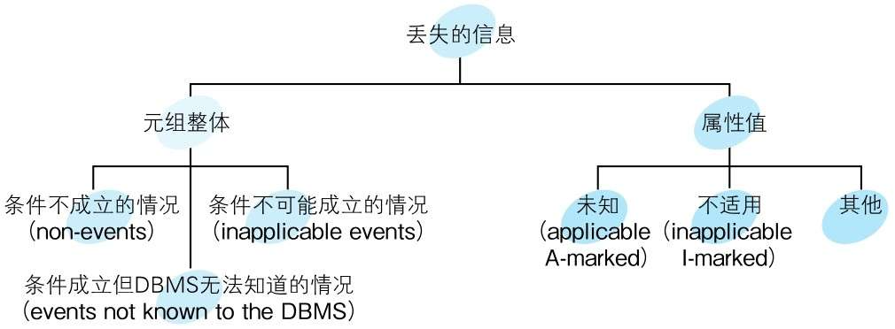
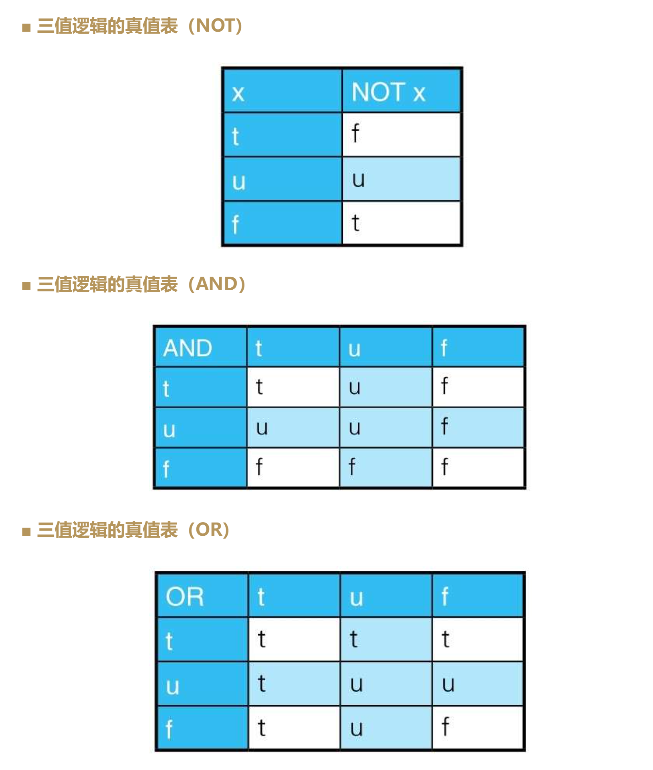
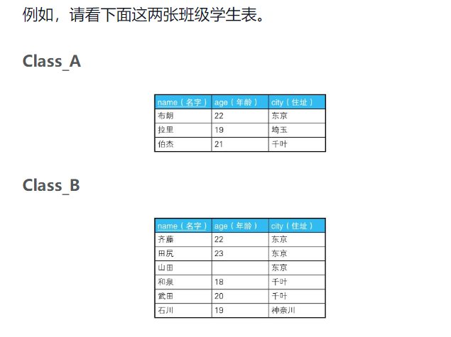
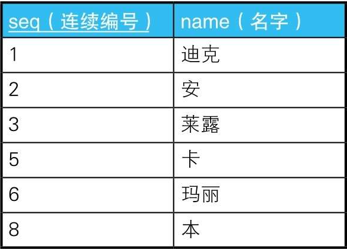

# SQL 进阶

## 1. 神奇的SQL

### 1.1 CASE表达式

CASE表达式有简单CASE表达式（simple case expression）和搜索CASE表达式（searched case expression）两种写法

```mysql
--简单CASE表达式
CASE sex
WHEN '1' THEN ’男’
WHEN '2' THEN ’女’
ELSE ’其他’ END

--搜索CASE表达式
CASE WHEN sex ='1'THEN’男’
WHEN sex ='2'THEN’女’
ELSE ’其他’ END
```

Notice:

- 返回的数据格式要统一
- END
- 通常要写ELSE

#### 将已有编号方式转换为新的方式并统计

在进行非定制化统计时，我们经常会遇到将已有编号方式转换为另外一种便于分析的方式并进行统计的需求。


```mysql
SELECT 
    CASE pref_name
        WHEN '德岛' THEN '四国'
        WHEN '香川' THEN '四国'
        WHEN '爱媛' THEN '四国'
        WHEN '高知' THEN '四国'
        WHEN '福冈' THEN '九州'
        WHEN '佐贺' THEN '九州'
        WHEN '长崎' THEN '九州'
        ELSE '其他'
    END AS district,
    SUM(population)
FROM
    PopTbl
GROUP BY CASE pref_name
    WHEN '德岛' THEN '四国'
    WHEN '香川' THEN '四国'
    WHEN '爱媛' THEN '四国'
    WHEN '高知' THEN '四国'
    WHEN '福冈' THEN '九州'
    WHEN '佐贺' THEN '九州'
    WHEN '长崎' THEN '九州'
    ELSE '其他'
END;
```

问题是在 select和groupby中都需要写CASE语句，是否可以在groupby中使用select中case的别名：SQL标准不可以，因为groupby子句比select语句先执行，所以在GROUP BY子句中引用在SELECT子句里定义的别称是不被允许的。

```mysql
SELECT 
    CASE pref_name
        WHEN '德岛' THEN '四国'
        WHEN '香川' THEN '四国'
        WHEN '爱媛' THEN '四国'
        WHEN '高知' THEN '四国'
        WHEN '福冈' THEN '九州'
        WHEN '佐贺' THEN '九州'
        WHEN '长崎' THEN '九州'
        ELSE '其他'
    END AS dist,
    SUM(population) AS pop
FROM
    PopTbl
GROUP BY dist
```

不过也有支持这种SQL语句的数据库，例如在PostgreSQL和MySQL中，这个查询语句就可以顺利执行。

#### 用一条SQL语句进行不同条件的统计

例如，我们需要往存储各县人口数量的表PopTbl里添加上“性别”列，然后求按性别、县名汇总的人数。


分别统计每个县的“男性”（即’1'）人数和“女性”（即’2'）人数。也就是说，这里是将“行结构”的数据转换成了“列结构”的数据。

```mysql
SELECT 
    pref_name,
    SUM(CASE
        WHEN sex = '1' THEN population
        ELSE 0
    END) AS cnt_m,
    SUM(CASE
        WHEN sex = '2' THEN population
        ELSE 0
    END) AS cnt_f
FROM
    poptbl2
GROUP BY pref_name
```

除了SUM, COUNT、AVG等聚合函数也都可以用于将行结构的数据转换成列结构的数据。

#### 用check约束定义多个列的条件关系

假设某公司规定“女性员工的工资必须在20万日元以下”

```mysql
CREATE TABLE TestSal (
    sex CHAR(1),
    salary INTEGER,
    CONSTRAINT check_salary CHECK (CASE
        WHEN
            sex = '2'
        THEN
            CASE
                WHEN salary <= 200000 THEN 1
                ELSE 0
            END
        ELSE 1
    END = 1)
);
```

check里面的结果等于0，那么check不通过。

重点理解的是蕴含式和逻辑与（logical product）的区别。

```sql
/* 蕴含式 conditional P->Q */
CONSTRAINT check_salary CHECK
( CASE WHEN sex = '2'
       THEN CASE WHEN salary <= 200000
                 THEN 1 ELSE 0 END
       ELSE 1 END = 1 )
       
       
/* 逻辑与 logical product P^Q */
CONSTRAINT check_salary CHECK
( sex = '2' AND salary <= 200000 )
```

要想让逻辑与P∧Q为真，需要命题P和命题Q均为真，或者一个为真且另一个无法判定真假。也就是说，能在这家公司工作的是“性别为女且工资在20万日元以下”的员工，以及性别或者工资无法确定的员工（如果一个条件为假，那么即使另一个条件无法确定真假，也不能在这里工作）。

而要想让蕴含式P→Q为真，需要命题P和命题Q均为真，或者P为假，或者P无法判定真假。也就是说如果不满足“是女性”这个前提条件，则无需考虑工资约束。

#### 在update语句里进行条件分支

下面思考一下这样一种需求：以某数值型的列的当前值为判断对象，将其更新成别的值。


```MySQL
UPDATE salaries 
SET 
    salary = CASE
        WHEN salary >= 300000 THEN salary * 0.9
        WHEN salary >= 250000 AND salary < 280000 THEN salary * 1.2
        ELSE salary
    END
```

这个技巧的应用范围很广。例如，可以用它简单地完成主键值调换这种繁重的工作。

```sql
UPDATE SomeTable 
SET 
    p_key = CASE
        WHEN p_key = 'a' THEN 'b'
        WHEN p_key = 'b' THEN 'a'
        ELSE p_key
    END
WHERE
    p_key IN ('a' , 'b');
```

#### 表之间的数据匹配

如下所示，这里有一张资格培训学校的课程一览表和一张管理每个月所设课程的表。


我们要用这两张表来生成下面这样的交叉表，以便于一目了然地知道每个月开设的课程。

```
    course_name   6月   7月   8月
    -----------  ----  ----  ----
    会计入门         ○    ×     ×
    财务知识         ×    ×    ○
    簿记考试         ○    ×     ×
    税务师           ○    ○    ○
```

检查表OpenCourses中的各月里有表CourseMaster中的哪些课程。这个匹配条件可以用CASE表达式来写。

```mysql

SELECT 
    course_name,
    CASE
        WHEN
            course_id IN (SELECT 
                    course_id
                FROM
                    OpenCourses
                WHERE
                    month = 200706)
        THEN
            '○'
        ELSE '×'
    END AS '6月',
    CASE
        WHEN
            course_id IN (SELECT 
                    course_id
                FROM
                    OpenCourses
                WHERE
                    month = 200707)
        THEN
            '○'
        ELSE '×'
    END AS '7月',
    CASE
        WHEN
            course_id IN (SELECT 
                    course_id
                FROM
                    OpenCourses
                WHERE
                    month = 200708)
        THEN
            '○'
        ELSE '×'
    END AS '8月'
FROM
    CourseMaster;
```

```sql

SELECT 
    CM.course_name,
    CASE
        WHEN
            EXISTS( SELECT 
                    course_id
                FROM
                    OpenCourses OC
                WHERE
                    month = 200706
                        AND OC.course_id = CM.course_id)
        THEN
            '○'
        ELSE '×'
    END AS '6月',
    CASE
        WHEN
            EXISTS( SELECT 
                    course_id
                FROM
                    OpenCourses OC
                WHERE
                    month = 200707
                        AND OC.course_id = CM.course_id)
        THEN
            '○'
        ELSE '×'
    END AS '7月',
    CASE
        WHEN
            EXISTS( SELECT 
                    course_id
                FROM
                    OpenCourses OC
                WHERE
                    month = 200708
                        AND OC.course_id = CM.course_id)
        THEN
            '○'
        ELSE '×'
    END AS '8月'
FROM
    CourseMaster CM;
```

#### 在case表达式中使用聚合函数

如表StudentClub所示，这张表的主键是“学号、社团ID”，存储了学生和社团之间多对多的关系。


接下来，我们按照下面的条件查询这张表里的数据。

1．获取只加入了一个社团的学生的社团ID。

```sql
SELECT 
    std_id, MAX(club_id) AS main_club
FROM
    studentclub
GROUP BY std_id
HAVING COUNT(*) = 1;
```

2．获取加入了多个社团的学生的主社团ID。

```sql
SELECT 
    std_id, club_id AS main_club
FROM
    studentclub
WHERE
    main_club_flg = 'Y';
```

而如果使用CASE表达式，下面这一条SQL语句就可以了。

```sql
SELECT 
    std_id,
    CASE
        WHEN COUNT(*) = 1 THEN MAX(club_id)
        ELSE MAX(CASE
            WHEN main_club_flg = 'Y' THEN club_id
            ELSE NULL
        END)
    END AS main_club
FROM
    StudentClub
GROUP BY std_id;
```

其主要目的是用CASE WHEN COUNT(＊) = 1 …… ELSE ……．这样的CASE表达式来表示“只加入了一个社团还是加入了多个社团”这样的条件分支。

CASE表达式用在SELECT子句里时，既可以写在聚合函数内部，也可以写在聚合函数外部。

作为表达式，CASE表达式在执行时会被判定为一个固定值，因此它可以写在聚合函数内部；也正因为它是表达式，所以还可以写在SELECE子句、GROUP BY子句、WHERE子句、ORDER BY子句里。简单点说，在能写列名和常量的地方，通常都可以写CASE表达式。

### 1.2 自连接的用法

针对相同的表进行的连接被称为“自连接”（self join）。

#### 可重排列 排列 组合



这里所说的组合其实分为两种类型。一种是有顺序的有序对（ordered pair），另一种是无顺序的无序对（unordered pair）。有序对用尖括号括起来，如<1, 2>；无序对用花括号括起来，如{1, 2}。

用SQL生成有序对非常简单。像下面这样通过交叉连接生成笛卡儿积（直积），就可以得到有序对：

```sql
SELECT 
    P1.name AS name_1, P2.name AS name_2
FROM
    Products P1,
    Products P2;
```

接下来，我们思考一下如何更改才能排除掉由相同元素构成的对。

```sql
SELECT 
    P1.name AS name_1, P2.name AS name_2
FROM
    Products P1,
    Products P2
WHERE
    P1.name <> P2.name;
```

原本所有的笛卡尔积为3x3 = 9，现在去掉相同的组合 3x3 - 每组的一个相同=6。

接下来我们进一步对（苹果，橘子）和（橘子，苹果）这样只是调换了元素顺序的对进行去重。

```SQL
SELECT 
    P1.name AS name_1, P2.name AS name_2
FROM
    Products P1,
    Products P2
WHERE
    P1.name > P2.name;
```

想要获取3个以上元素的组合时，像下面这样简单地扩展一下就可以了。这次的样本数据只有3行，所以结果应该只有1行。

```SQL
SELECT 
    P1.name AS name_1, P2.name AS name_2, P3.name AS name_3
FROM
    Products P1,
    Products P2,
    Products P3
WHERE
    P1.name > P2.name AND P2.name > P3.name;
```

#### 删除重复行



重复行有多少行都没有关系。通常，如果重复的列里不包含主键，就可以用主键来处理，但像这道例题一样所有的列都重复的情况，则需要使用由数据库独自实现的行ID。

```SQL
    --用于删除重复行的SQL语句(1)：使用极值函数
    DELETE FROM Products P1
     WHERE rowid < ( SELECT MAX(P2.rowid)
                      FROM Products P2
                      WHERE P1.name = P2. name
                        AND P1.price = P2.price ) ;
```

对于在SQL语句里被赋予不同名称的集合，我们应该将其看作完全不同的集合。这个子查询会比较两个集合P1和P2，然后返回商品名称和价格都相同的行里最大的rowid所在的行。

于是，由于苹果和香蕉没有重复行，所以返回的行是“1：苹果”“5：香蕉”，而判断条件是不等号，所以该行不会被删除。而对于“橘子”这个商品，程序返回的行是“4：橘子”，那么rowid比4小的两行——“2：橘子”和“3：橘子”都会被删除。

#### 查找局部不一致的列

假设有下面这样一张住址表，主键是人名，同一家人家庭ID一样。



如果家庭ID一样，住址也必须一样，因此这里需要修改一下。那么我们该如何找出像前田夫妇这样的“是同一家人但住址却不同的记录”呢？

```SQL
SELECT DISTINCT
    A1.name, A1.address
FROM
    addresses A1,
    addresses A2
WHERE
    A1.family_id = A2.family_id
        AND A1.address <> A2.address
```

像这样把自连接和非等值连接结合起来确实非常好用。



```SQL
SELECT DISTINCT
    P1.name, P1.price
FROM
    Products P1,
    Products P2
WHERE
    P1.price = P2.price
        AND P1.name <> P2.name;
```

#### 排序

在使用数据库制作各种票据和统计表的工作中，我们经常会遇到按分数、人数或销售额等数值进行排序的需求。

现在，我们要按照价格从高到低的顺序，对下面这张表里的商品进行排序。我们让价格相同的商品位次也一样，而紧接着它们的商品则有两种排序方法，一种是跳过之后的位次，另一种是不跳过之后的位次。



可以使用窗口函数：

```SQL
SELECT name, price, RANK() OVER (ORDER BY price DESC) AS rank_1,   DENSE_RANK() OVER (ORDER BY price DESC) AS rank_2
FROM Products;
```

可以使用非等值自连接：

```SQL
SELECT 
    p1.name,
    p1.price,
    (SELECT 
            COUNT(p2.price)
        FROM
            products p2
        WHERE
            p2.price > p1.price) + 1 AS rank_1
FROM
    products p1
ORDER BY rank_1;
```

去掉标量子查询后边的+1，就可以从0开始给商品排序，而且如果修改成COUNT(DISTINCT P2.price)，那么存在相同位次的记录时，就可以不跳过之后的位次，而是连续输出（相当于DENSE_RANK函数）。

这条SQL语句的执行原理：体现了面向集合的思维方式，子查询所做的，是计算出价格比自己高德记录的条数并将其作为自己的位次。

为了便于理解，我们先考虑从0开始，对去重之后的4个价格“{ 100, 80,50, 30 }”进行排序的情况。首先是价格最高的100，因为不存在比它高的价格，所以COUNT函数返回0。接下来是价格第二高的80，比它高的价格有一个100，所以COUNT函数返回1。同样地，价格为50的时候返回2，为30的时候返回3。这样，就生成了一个与每个价格对应的集合，如下表所示。



这条SQL语句会生成这样几个“同心圆状的” 递归集合，然后数这些集合的元素个数。

顺便说一下，这个子查询的代码还可以像下面这样按照自连接的写法来改写。

```SQL
SELECT 
    p1.name,
    MAX(p1.price) AS price,
    COUNT(p2.name) + 1 AS rank_1
FROM
    products p1
        LEFT OUTER JOIN
    products p2 ON p1.price < p2.price
GROUP BY p1.name
ORDER BY rank_1
```

去掉这条SQL语句里的聚合并展开成下面这样，就可以更清楚地看出同心圆状的包含关系：

```SQL
SELECT 
    P1.name, P2.name
FROM
    Products P1
        LEFT OUTER JOIN
    Products P2 ON P1.price < P2.price;
```

这里使用外连接的原因：我们需要包含左边的所有数据。

下面是本节要点。

1．自连接经常和非等值连接结合起来使用。

2．自连接和GROUP BY结合使用可以生成递归集合。

3．将自连接看作不同表之间的连接更容易理解。

4．应把表看作行的集合，用面向集合的方法来思考。

5．自连接的性能开销更大，应尽量给用于连接的列建立索引。

### 1.3 三值逻辑和NULL

总之，数据库里只要存在一个NULL，查询的结果就可能不正确。

普通语言里的布尔型只有true和false两个值，这种逻辑体系被称为二值逻辑。而SQL语言里，除此之外还有第三个值unknown，因此这种逻辑体系被称为三值逻辑（three-valued logic）。

#### 理论篇

第一 两种NULL的说法：

两种NULL分别指的是“未知”（unknown）和“不适用”（not applicable, inapplicable）。以“不知道戴墨镜的人眼睛是什么颜色”这种情况为例，这个人的眼睛肯定是有颜色的，但是如果他不摘掉眼镜，别人就不知道他的眼睛是什么颜色。这就叫作未知。而“不知道冰箱的眼睛是什么颜色”则属于“不适用”。因为冰箱根本就没有眼睛，所以“眼睛的颜色”这一属性并不适用于冰箱。



**为什么必须写成 IS NULL**

```mysql
-- 查询NULL时出错的SQL语句
SELECT *
  FROM tbl_A
WHERE col_1 = NULL;
```

对NULL使用比较谓词后得到的结果总是unknown。而查询结果只会包含WHERE子句里的判断结果为true的行，不会包含判断结果为false和unknown的行。不只是等号，对NULL使用其他比较谓词，结果也都是一样的。所以无论col_1是不是NULL，比较结果都是unknown。

那么，为什么对NULL使用比较谓词后得到的结果永远不可能为真呢？这是因为，NULL既不是值也不是变量。NULL只是一个表示“没有值”的标记，而比较谓词只适用于值。因此，对并非值的NULL使用比较谓词本来就是没有意义的

*NULL并不是值。*

**unknown 、第三个真值**

终于轮到真值unknown登场了。本节开头也提到过，它是因关系数据库采用了NULL而被引入的“第三个真值”。

这里有一点需要注意：真值unknown和作为NULL的一种的UNKNOWN（未知）是不同的东西。前者是明确的布尔型的真值，后者既不是值也不是变量。为了便于区分，前者采用粗体的小写字母unknown，后者用普通的大写字母UNKNOWN来表示。为了让大家理解两者的不同，我们来看一个x=x这样的简单等式。x是真值unknown时，x=x被判断为true，而x是UNKNOWN时被判断为unknown。



为了便于记忆，请注意这三个真值之间有下面这样的优先级顺序:

```
AND的情况： false ＞ unknown ＞ true

OR的情况： true ＞ unknown ＞ false
```

#### 实践篇

**比较谓词和NULL(1): 排中律不成立**

像这样，“把命题和它的否命题通过‘或者’连接而成的命题全都是真命题”这个命题在二值逻辑中被称为排中律（Law of Excluded Middle）。顾名思义，排中律就是指不认可中间状态，对命题真伪的判定黑白分明，是古典逻辑学的重要原理。

**比较谓词和NULL(2):CASE表达式和NULL**

```sql
    --col_1为1时返回○、为NULL时返回×的CASE表达式？
    CASE col_1
      WHEN 1     THEN'○'
      WHEN NULL  THEN'×'
    END
```

这个CASE表达式一定不会返回×。这是因为，第二个WHEN子句是col_1 = NULL的缩写形式。正如大家所知，这个式子的真值永远是unknown。而且CASE表达式的判断方法与WHERE子句一样，只认可真值为true的条件。

```sql
    CASE WHEN col_1 = 1 THEN'○'
        WHEN col_1 IS NULL THEN'×'
     END
```

**NOT IN和NOT EXISTS不是等价的**

在对SQL语句进行性能优化时，经常用到的一个技巧是将IN改写成EXISTS



我们考虑一下如何根据这两张表查询“与B班住在东京的学生年龄不同的A班学生”。

```sql
    --查询与B班住在东京的学生年龄不同的A班学生的SQL语句？
    SELECT *
      FROM Class_A
     WHERE age NOT IN ( SELECT age
                          FROM Class_B
                        WHERE city =’东京’);
```

这个语句查询不到结果。可以看出，这里对A班的所有行都进行了如此繁琐的判断，然而没有一行在WHERE子句里被判断为true。也就是说，如果NOT IN子查询中用到的表里被选择的列中存在NULL，则SQL语句整体的查询结果永远是空。

```SQL
SELECT 
    *
FROM
    Class_A A
WHERE
    NOT EXISTS( SELECT 
            *
        FROM
            Class_B B
        WHERE
            A.age = B.age AND B.city = ’东京’);
```

产生这样的结果，是因为EXISTS谓词永远不会返回unknown。EXISTS只会返回true或者false。

**限定谓词和NULL**

SQL里有ALL和ANY两个限定谓词。因为ANY与IN是等价的，所以我们不经常使用ANY。

ALL谓词其实是多个以AND连接的逻辑表达式的省略写法。

**限定谓词和极值函数不是等价的**

极值函数在统计时会把为NULL的数据排除掉。

### 1.4 HAVING子句的力量

#### 寻找缺失的编号



如果这张表的数据存储在文件里，那么用面向过程语言查询时，步骤应该像下面这样。

1．对“连续编号”列按升序或者降序进行排序。

2．循环比较每一行和下一行的编号。

SQL会将多条记录作为一个集合来处理，因此如果将表整体看作一个集合：

```SQL
SELECT 
    'have gap' AS gap
FROM
    seqtbl
HAVING COUNT(*) <> MAX(seq);
```

如果这个查询结果有1行，说明存在缺失的编号；如果1行都没有，说明不存在缺失的编号。这是因为，如果用COUNT(＊)统计出来的行数等于“连续编号”列的最大值，就说明编号从开始到最后是连续递增的，中间没有缺失。如果有缺失，COUNT(＊)会小于MAX(seq)，这样HAVING子句就变成真了。

