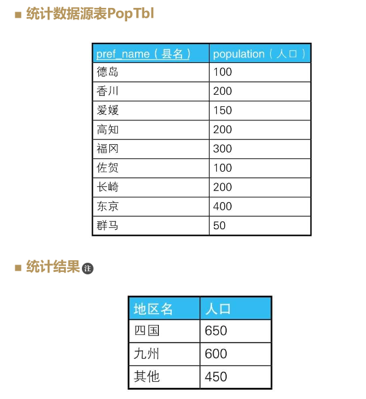
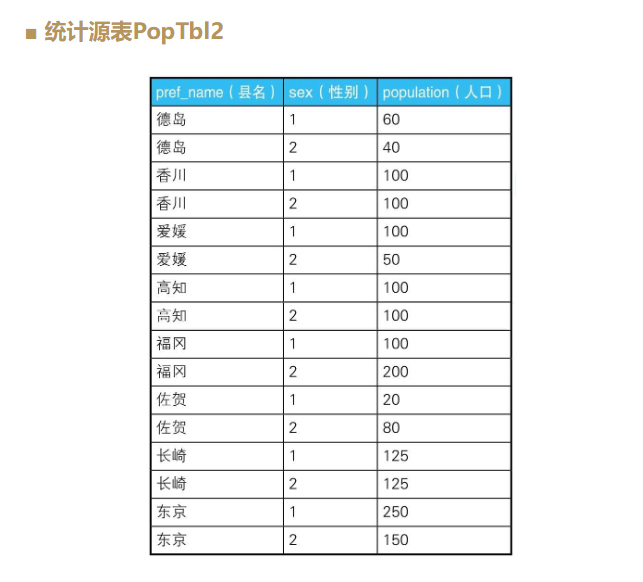
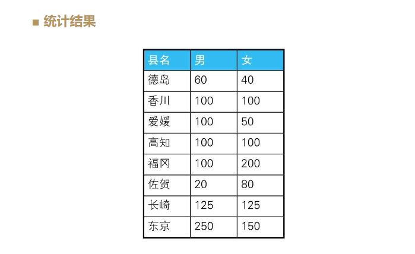
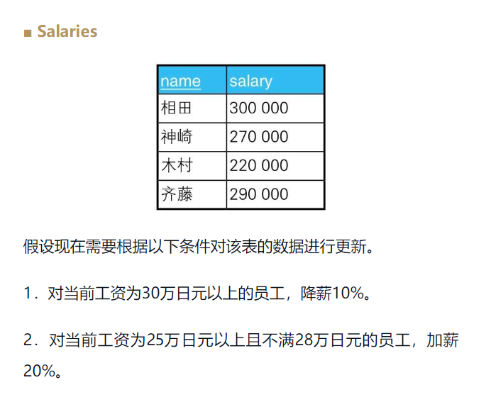
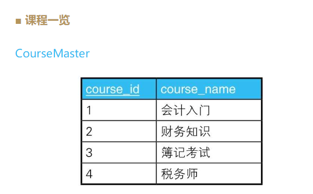
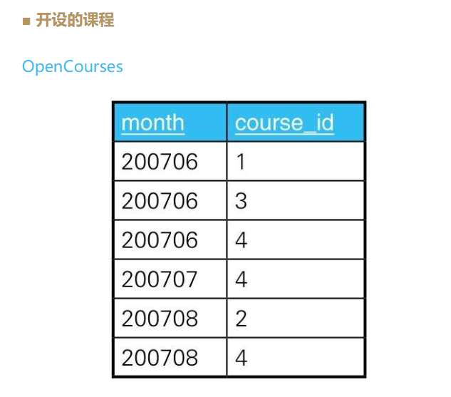
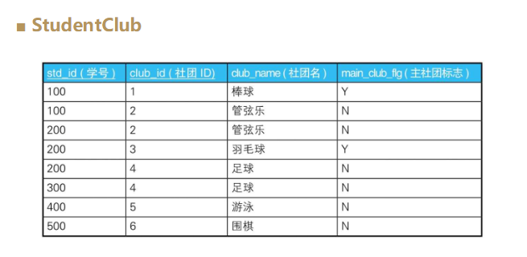

# SQL 进阶

## chapter1

### 1.1 CASE表达式

CASE表达式有简单CASE表达式（simple case expression）和搜索CASE表达式（searched case expression）两种写法

```mysql
--简单CASE表达式
CASE sex
WHEN '1' THEN ’男’
WHEN '2' THEN ’女’
ELSE ’其他’ END

--搜索CASE表达式
CASE WHEN sex ='1'THEN’男’
WHEN sex ='2'THEN’女’
ELSE ’其他’ END
```

Notice:

- 返回的数据格式要统一
- END
- 通常要写ELSE

#### 将已有编号方式转换为新的方式并统计

在进行非定制化统计时，我们经常会遇到将已有编号方式转换为另外一种便于分析的方式并进行统计的需求。



```mysql
SELECT 
    CASE pref_name
        WHEN '德岛' THEN '四国'
        WHEN '香川' THEN '四国'
        WHEN '爱媛' THEN '四国'
        WHEN '高知' THEN '四国'
        WHEN '福冈' THEN '九州'
        WHEN '佐贺' THEN '九州'
        WHEN '长崎' THEN '九州'
        ELSE '其他'
    END AS district,
    SUM(population)
FROM
    PopTbl
GROUP BY CASE pref_name
    WHEN '德岛' THEN '四国'
    WHEN '香川' THEN '四国'
    WHEN '爱媛' THEN '四国'
    WHEN '高知' THEN '四国'
    WHEN '福冈' THEN '九州'
    WHEN '佐贺' THEN '九州'
    WHEN '长崎' THEN '九州'
    ELSE '其他'
END;
```

问题是在 select和groupby中都需要写CASE语句，是否可以在groupby中使用select中case的别名：SQL标准不可以，因为groupby子句比select语句先执行，所以在GROUP BY子句中引用在SELECT子句里定义的别称是不被允许的。

```mysql
SELECT 
    CASE pref_name
        WHEN '德岛' THEN '四国'
        WHEN '香川' THEN '四国'
        WHEN '爱媛' THEN '四国'
        WHEN '高知' THEN '四国'
        WHEN '福冈' THEN '九州'
        WHEN '佐贺' THEN '九州'
        WHEN '长崎' THEN '九州'
        ELSE '其他'
    END AS dist,
    SUM(population) AS pop
FROM
    PopTbl
GROUP BY dist
```

不过也有支持这种SQL语句的数据库，例如在PostgreSQL和MySQL中，这个查询语句就可以顺利执行。

#### 用一条SQL语句进行不同条件的统计

例如，我们需要往存储各县人口数量的表PopTbl里添加上“性别”列，然后求按性别、县名汇总的人数。





分别统计每个县的“男性”（即’1'）人数和“女性”（即’2'）人数。也就是说，这里是将“行结构”的数据转换成了“列结构”的数据。

```mysql
SELECT 
    pref_name,
    SUM(CASE
        WHEN sex = '1' THEN population
        ELSE 0
    END) AS cnt_m,
    SUM(CASE
        WHEN sex = '2' THEN population
        ELSE 0
    END) AS cnt_f
FROM
    poptbl2
GROUP BY pref_name
```

除了SUM, COUNT、AVG等聚合函数也都可以用于将行结构的数据转换成列结构的数据。

#### 用check约束定义多个列的条件关系

假设某公司规定“女性员工的工资必须在20万日元以下”

```mysql
CREATE TABLE TestSal (
    sex CHAR(1),
    salary INTEGER,
    CONSTRAINT check_salary CHECK (CASE
        WHEN
            sex = '2'
        THEN
            CASE
                WHEN salary <= 200000 THEN 1
                ELSE 0
            END
        ELSE 1
    END = 1)
);
```

check里面的结果等于0，那么check不通过。

重点理解的是蕴含式和逻辑与（logical product）的区别。

```sql
/* 蕴含式 conditional P->Q */
CONSTRAINT check_salary CHECK
( CASE WHEN sex = '2'
       THEN CASE WHEN salary <= 200000
                 THEN 1 ELSE 0 END
       ELSE 1 END = 1 )
       
       
/* 逻辑与 logical product P^Q */
CONSTRAINT check_salary CHECK
( sex = '2' AND salary <= 200000 )
```

要想让逻辑与P∧Q为真，需要命题P和命题Q均为真，或者一个为真且另一个无法判定真假。也就是说，能在这家公司工作的是“性别为女且工资在20万日元以下”的员工，以及性别或者工资无法确定的员工（如果一个条件为假，那么即使另一个条件无法确定真假，也不能在这里工作）。

而要想让蕴含式P→Q为真，需要命题P和命题Q均为真，或者P为假，或者P无法判定真假。也就是说如果不满足“是女性”这个前提条件，则无需考虑工资约束。

#### 在update语句里进行条件分支

下面思考一下这样一种需求：以某数值型的列的当前值为判断对象，将其更新成别的值。



```MySQL
UPDATE salaries 
SET 
    salary = CASE
        WHEN salary >= 300000 THEN salary * 0.9
        WHEN salary >= 250000 AND salary < 280000 THEN salary * 1.2
        ELSE salary
    END
```

这个技巧的应用范围很广。例如，可以用它简单地完成主键值调换这种繁重的工作。

```sql
UPDATE SomeTable 
SET 
    p_key = CASE
        WHEN p_key = 'a' THEN 'b'
        WHEN p_key = 'b' THEN 'a'
        ELSE p_key
    END
WHERE
    p_key IN ('a' , 'b');
```

#### 表之间的数据匹配

如下所示，这里有一张资格培训学校的课程一览表和一张管理每个月所设课程的表。





我们要用这两张表来生成下面这样的交叉表，以便于一目了然地知道每个月开设的课程。

```
    course_name   6月   7月   8月
    -----------  ----  ----  ----
    会计入门         ○    ×     ×
    财务知识         ×    ×    ○
    簿记考试         ○    ×     ×
    税务师           ○    ○    ○
```

检查表OpenCourses中的各月里有表CourseMaster中的哪些课程。这个匹配条件可以用CASE表达式来写。

```mysql

SELECT 
    course_name,
    CASE
        WHEN
            course_id IN (SELECT 
                    course_id
                FROM
                    OpenCourses
                WHERE
                    month = 200706)
        THEN
            '○'
        ELSE '×'
    END AS '6月',
    CASE
        WHEN
            course_id IN (SELECT 
                    course_id
                FROM
                    OpenCourses
                WHERE
                    month = 200707)
        THEN
            '○'
        ELSE '×'
    END AS '7月',
    CASE
        WHEN
            course_id IN (SELECT 
                    course_id
                FROM
                    OpenCourses
                WHERE
                    month = 200708)
        THEN
            '○'
        ELSE '×'
    END AS '8月'
FROM
    CourseMaster;
```

```sql

SELECT 
    CM.course_name,
    CASE
        WHEN
            EXISTS( SELECT 
                    course_id
                FROM
                    OpenCourses OC
                WHERE
                    month = 200706
                        AND OC.course_id = CM.course_id)
        THEN
            '○'
        ELSE '×'
    END AS '6月',
    CASE
        WHEN
            EXISTS( SELECT 
                    course_id
                FROM
                    OpenCourses OC
                WHERE
                    month = 200707
                        AND OC.course_id = CM.course_id)
        THEN
            '○'
        ELSE '×'
    END AS '7月',
    CASE
        WHEN
            EXISTS( SELECT 
                    course_id
                FROM
                    OpenCourses OC
                WHERE
                    month = 200708
                        AND OC.course_id = CM.course_id)
        THEN
            '○'
        ELSE '×'
    END AS '8月'
FROM
    CourseMaster CM;
```

#### 在case表达式中使用聚合函数

如表StudentClub所示，这张表的主键是“学号、社团ID”，存储了学生和社团之间多对多的关系。



接下来，我们按照下面的条件查询这张表里的数据。

1．获取只加入了一个社团的学生的社团ID。

```sql
SELECT 
    std_id, MAX(club_id) AS main_club
FROM
    studentclub
GROUP BY std_id
HAVING COUNT(*) = 1;
```

2．获取加入了多个社团的学生的主社团ID。

```sql
SELECT 
    std_id, club_id AS main_club
FROM
    studentclub
WHERE
    main_club_flg = 'Y';
```

而如果使用CASE表达式，下面这一条SQL语句就可以了。

```sql
SELECT 
    std_id,
    CASE
        WHEN COUNT(*) = 1 THEN MAX(club_id)
        ELSE MAX(CASE
            WHEN main_club_flg = 'Y' THEN club_id
            ELSE NULL
        END)
    END AS main_club
FROM
    StudentClub
GROUP BY std_id;
```

其主要目的是用CASE WHEN COUNT(＊) = 1 …… ELSE ……．这样的CASE表达式来表示“只加入了一个社团还是加入了多个社团”这样的条件分支。

CASE表达式用在SELECT子句里时，既可以写在聚合函数内部，也可以写在聚合函数外部。

作为表达式，CASE表达式在执行时会被判定为一个固定值，因此它可以写在聚合函数内部；也正因为它是表达式，所以还可以写在SELECE子句、GROUP BY子句、WHERE子句、ORDER BY子句里。简单点说，在能写列名和常量的地方，通常都可以写CASE表达式。

