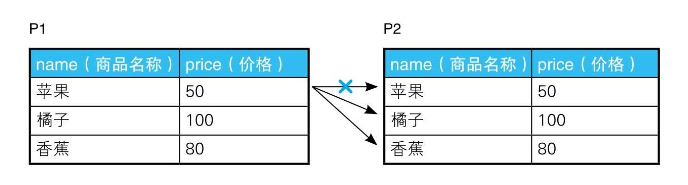
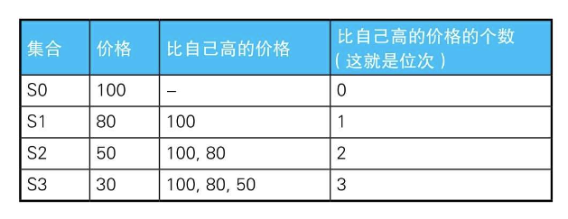
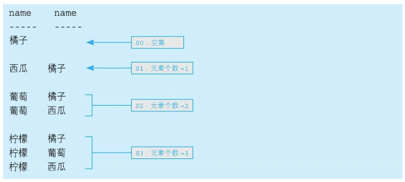

# 1-2 自连接的用法

理解自连接不仅可以让我们学会实际工作中能用到的技能，还能增进我们对“面向集合”这一SQL语言重要特征的理解。面向对象语言以对象的方式来描述世界，而面向集合语言SQL以集合的方式来描述世界。自连接技术充分体现了SQL面向集合的特性，相信大家在读完本节后再看二维表状的表格时，就会觉得这种表格更像是集合。

> todo: exists 的用法

## 可重排列 排列 组合

> todo: mysql join

假设这里有一张存放了商品名称及价格的表，表里有“苹果、橘子、香蕉”这3条记录。

```
+----+-----+
|name|price|
+----+-----+
|橘子  |100  |
|苹果  |50   |
|香蕉  |80   |
+----+-----+

table: products
```

这里所说的组合其实分为两种类型: 一种是有顺序的有序对（ordered pair），另一种是无顺序的无序对（unordered pair）。有序对用尖括号括起来，如<1,2>；无序对用花括号括起来，如{1, 2}。

这两类分别对应着“排列”和“组合”。

1，用SQL生成有序对非常简单：

```SQL
SELECT 
    p1.name AS name_1, p2.name AS name_2
FROM
    products p1,
    products p2;
    
/*
+------+------+
|name_1|name_2|
+------+------+
|橘子    |橘子    |
|苹果    |橘子    |
|香蕉    |橘子    |
|橘子    |苹果    |
|苹果    |苹果    |
|香蕉    |苹果    |
|橘子    |香蕉    |
|苹果    |香蕉    |
|香蕉    |香蕉    |
+------+------+
*/
```

2，排除掉由相同元素构成的对：

```SQL
SELECT 
    p1.name AS name_1, p2.name AS name_2
FROM
    products p1,
    products p2
WHERE
    p1.name <> p2.name

/*
+------+------+
|name_1|name_2|
+------+------+
|苹果    |橘子    |
|香蕉    |橘子    |
|橘子    |苹果    |
|香蕉    |苹果    |
|橘子    |香蕉    |
|苹果    |香蕉    |
+------+------+
*/
```

这个SQL的原理如下：



3，对（苹果，橘子）和（橘子，苹果）这样只是调换了元素顺序的对进行去重：

```SQL
SELECT 
    p1.name AS name_1, p2.name AS name_2
FROM
    products p1,
    products p2
WHERE
    p1.name > p2.name

/*
+------+------+
|name_1|name_2|
+------+------+
|苹果    |橘子    |
|香蕉    |橘子    |
|香蕉    |苹果    |
+------+------+

*/
```

使用等号“＝”以外的比较运算符，如“<、>、<>”进行的连接称为“非等值连接”。这里将非等值连接与自连接结合使用了，因此称为“非等值自连接”。

## 删除重复行

例如，前面的例题用过一张商品表，现在假设在这张表里，“橘子”这种商品存在重复。

```
+--+----+-----+
|id|name|price|
+--+----+-----+
|7 |苹果  |50   |
|8 |橘子  |100  |
|9 |香蕉  |80   |
|10|橘子  |100  |
|11|橘子  |100  |
+--+----+-----+

table: products
```

使用关联子查询删除重复行的方法:

```SQL
SELECT 
    p1.id AS p1_id,
    p1.name AS p1_name,
    p1.price AS p1_price,
    p2.id AS p2_id,
    p2.name AS p2_name,
    p2.price AS p2_price
FROM
    products p1,
    products p2
WHERE
    p1.name = p2.name
        AND p1.price = p2.price
        AND p2.id > p1.id;

/*
+-----+-------+--------+-----+-------+--------+
|p1_id|p1_name|p1_price|p2_id|p2_name|p2_price|
+-----+-------+--------+-----+-------+--------+
|8    |橘子     |100     |10   |橘子     |100     |
|8    |橘子     |100     |11   |橘子     |100     |
|10   |橘子     |100     |11   |橘子     |100     |
+-----+-------+--------+-----+-------+--------+

*/

DELETE FROM Products P1
     WHERE id < ( SELECT MAX(P2.id)
                      FROM Products P2
                      WHERE P1.name = P2. name
                        AND P1.price = P2.price ) ;

DELETE
FROM Products P1
WHERE EXISTS(SELECT *
             FROM Products P2
             WHERE P1.name = P2.name
               AND P1.price = P2.price
               AND P1.id < P2.id);
```

由于苹果和香蕉没有重复行，所以返回的行是`“7：苹果”` `“8：香蕉”`，而判断条件是不等号，所以该行不会被删除。而对于“橘子”这个商品，程序返回的行是`“11：橘子”`，那么rowid比4小的两行——`“9：橘子”`和`“10：橘子”`都会被删除。

但是这个删除语句在MySQL会报错：[subquery - MySQL Error 1093 - Can't specify target table for update in FROM clause - Stack Overflow](https://stackoverflow.com/questions/45494/mysql-error-1093-cant-specify-target-table-for-update-in-from-clause)。

集合是SQL能处理的唯一的数据结构。

## 查找局部不一致的列

> todo: distinct关键字的用法
>
> The `SELECT DISTINCT` statement is used to return only distinct (different) values.
>
> `SELECT COUNT(DISTINCT Country) FROM Customers;`

假设有下面这样一张住址表，主键是人名，同一家人家庭ID一样。

```
+----+---------+--------------+
|name|family_id|address       |
+----+---------+--------------+
|前田义明|100      |东京都港区虎之门3-2-29|
|前田由美|100      |东京都港区虎之门3-2-92|
|加藤胜 |200      |东京都新宿区西新宿2-8-1|
|加藤茶 |200      |东京都新宿区西新宿2-8-1|
|华生  |400      |贝克街221B       |
|福尔摩斯|300      |贝克街221B       |
+----+---------+--------------+

table: addresses
```

一般来说，同一家人一般住在一起。不同家人也有可能住在一起。

现在要找出同一家人，家庭住址不一样的记录：

```SQL
SELECT DISTINCT
    A1.name,
    A1.address,
    a2.name AS a2_name,
    a2.address AS a2_address
FROM
    Addresses A1,
    Addresses A2
WHERE
    A1.family_id = A2.family_id
        AND A1.address <> A2.address;

/*
+----+--------------+-------+--------------+
|name|address       |a2_name|a2_address    |
+----+--------------+-------+--------------+
|前田由美|东京都港区虎之门3-2-92|前田义明   |东京都港区虎之门3-2-29|
|前田义明|东京都港区虎之门3-2-29|前田由美   |东京都港区虎之门3-2-92|
+----+--------------+-------+--------------+

*/
```

### 找出价格相等的商品的组合

```
+--+----+-----+
|id|name|price|
+--+----+-----+
|1 |苹果  |50   |
|2 |橘子  |100  |
|3 |葡萄  |50   |
|4 |西瓜  |80   |
|5 |柠檬  |30   |
|6 |香蕉  |50   |
+--+----+-----+

table: products
```

```SQL
SELECT DISTINCT
    P1.name, P1.price
FROM
    Products P1,
    Products P2
WHERE
    P1.price = P2.price
        AND P1.name <> P2.name;

/*
+----+-----+
|name|price|
+----+-----+
|葡萄  |50   |
|香蕉  |50   |
|苹果  |50   |
+----+-----+

*/

SELECT distinct
    P1.name, P1.price, p2.name AS p2_name, p2.price AS p2_price
FROM
    Products P1,
    Products P2
WHERE
    P1.price = P2.price
        AND P1.name <> P2.name;

/*
+----+-----+-------+--------+
|name|price|p2_name|p2_price|
+----+-----+-------+--------+
|葡萄  |50   |苹果     |50      |
|香蕉  |50   |苹果     |50      |
|苹果  |50   |葡萄     |50      |
|香蕉  |50   |葡萄     |50      |
|苹果  |50   |香蕉     |50      |
|葡萄  |50   |香蕉     |50      |
+----+-----+-------+--------+

*/
```

## 排序

在使用数据库制作各种票据和统计表的工作中，我们经常会遇到按分数、人数或销售额等数值进行排序的需求。

```
+--+----+-----+
|id|name|price|
+--+----+-----+
|1 |苹果  |50   |
|2 |橘子  |100  |
|3 |葡萄  |50   |
|4 |西瓜  |80   |
|5 |柠檬  |30   |
|6 |香蕉  |50   |
+--+----+-----+
```

1，使用窗口函数：

```SQL
select name,
       price,
       rank() over (order by price desc)       as rank_1,
       dense_rank() over (order by price desc) as rank_2
from products;


/*
+----+-----+------+------+
|name|price|rank_1|rank_2|
+----+-----+------+------+
|橘子  |100  |1     |1     |
|西瓜  |80   |2     |2     |
|苹果  |50   |3     |3     |
|葡萄  |50   |3     |3     |
|香蕉  |50   |3     |3     |
|柠檬  |30   |6     |4     |
+----+-----+------+------+
*/
```

2，使用非等值自连接：

```SQL
SELECT 
    p1.name,
    p1.price,
    (SELECT 
            COUNT(p2.price)
        FROM
            products p2
        WHERE
            p2.price > p1.price) + 1 AS rank_1
FROM
    products p1
ORDER BY rank_1;

/*
+----+-----+------+
|name|price|rank_1|
+----+-----+------+
|橘子  |100  |1     |
|西瓜  |80   |2     |
|苹果  |50   |3     |
|葡萄  |50   |3     |
|香蕉  |50   |3     |
|柠檬  |30   |6     |
+----+-----+------+

*/
```

这段代码可以进行扩展：去掉标量子查询后边的 +1，就可以从0开始给商品排序，而且如果修改成`COUNT(DISTINCT P2.price)`，那么存在相同位次的记录时，就可以不跳过之后的位次，而是连续输出（相当于DENSE_RANK函数）。

这条SQL语句的执行原理：

子查询所做的，是计算出价格比自己高的记录的条数并将其作为自己的位次。为了便于理解，对去重之后的4个价格“{ 100,80, 50, 30 }”进行排序的情况。首先是价格最高的100，因为不存在比它高的价格，所以COUNT函数返回0。接下来是价格第二高的80，比它高的价格有一个100，所以COUNT函数返回1。同样地，价格为50的时候返回2，为30的时候返回3。



这条SQL语句会生成这样几个 同心圆状的递归集合，然后数这些集合的元素个数。这些数据里面，价格最小的，比自己高的包含的集合是最多的: `S3 ∪ S2 ∪ S1 ∪ S0`

实际上，“通过递归集合来定义数” 这个想法并不算新颖。有趣的是，它和集合论里沿用了100多年的自然数（包含0）的递归定义（recursive definition）在思想上不谋而合。

3，另一种写法：

[MySQL Joins (w3schools.com)](https://www.w3schools.com/mysql/mysql_join.asp)

```SQL
SELECT P1.name,
    MAX(P1.price) AS price,
    COUNT(P2.name) +1 AS rank_1
FROM Products P1 LEFT OUTER JOIN Products P2
ON P1.price < P2.price
GROUP BY P1.name
ORDER BY rank_1;

-- 查看集合的包含关系
SELECT P1.name, P2.name
  FROM Products P1 LEFT OUTER JOIN Products P2
    ON P1.price < P2.price;
```



## 小结

与多表之间进行的普通连接相比，自连接的性能开销更大（特别是与非等值连接结合使用的时候），因此用于自连接的列推荐使用主键或者在相关列上建立索引。

1．自连接经常和非等值连接结合起来使用。

2．自连接和GROUP BY结合使用可以生成递归集合。

3．将自连接看作不同表之间的连接更容易理解。

4．应把表看作行的集合，用面向集合的方法来思考。

5．自连接的性能开销更大，应尽量给用于连接的列建立索引。

### 练习题1-2-2 分地区排序

```
+--------+----+-----+
|district|name|price|
+--------+----+-----+
|东北      |柠檬  |30   |
|东北      |橘子  |100  |
|东北      |苹果  |50   |
|东北      |葡萄  |50   |
|关东      |柠檬  |100  |
|关东      |苹果  |100  |
|关东      |菠萝  |100  |
|关东      |葡萄  |70   |
|关西      |柠檬  |70   |
|关西      |苹果  |20   |
|关西      |西瓜  |30   |
+--------+----+-----+
```

1, 窗口函数解法：

```SQL
SELECT district,
       name,
       price,
       RANK() OVER (PARTITION BY district
           ORDER BY price DESC) AS rank_1
FROM DistrictProducts
order by district, rank_1;

/*
+--------+----+-----+------+
|district|name|price|rank_1|
+--------+----+-----+------+
|东北      |橘子  |100  |1     |
|东北      |苹果  |50   |2     |
|东北      |葡萄  |50   |2     |
|东北      |柠檬  |30   |4     |
|关东      |柠檬  |100  |1     |
|关东      |苹果  |100  |1     |
|关东      |菠萝  |100  |1     |
|关东      |葡萄  |70   |4     |
|关西      |柠檬  |70   |1     |
|关西      |西瓜  |30   |2     |
|关西      |苹果  |20   |3     |
+--------+----+-----+------+

*/

SELECT P1.district,
       P1.name,
       P1.price,
       (SELECT COUNT(P2.price)
        FROM DistrictProducts P2
        WHERE P1.district = P2.district
          AND P2.price > P1.price) + 1 AS rank_1
FROM DistrictProducts P1;
```

