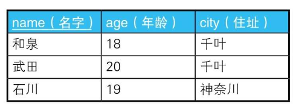

# 1-3 三值逻辑和NULL

## 理论

两种NULL:是“未知”（unknown）和“不适用”（not applicable,inapplicable）

总结一下：“未知”指的是“虽然现在不知道，但加上某些条件后就可以知道”；而“不适用”指的是“无论怎么努力都无法知道”。

### 为什么是 `is NULL`

对NULL使用比较谓词后得到的结果总是unknown。而查询结果只会包含WHERE子句里的判断结果为true的行，不会包含判断结果为false和unknown的行。

为什么对NULL使用比较谓词后得到的结果永远不可能为真呢？这是因为，NULL既不是值也不是变量。NULL只是一个表示“没有值”的标记，而比较谓词只适用于值。因此，对并非值的NULL使用比较谓词本来就是没有意义的。

### unknown 第三个真值

真值unknown。

真值unknown和作为NULL的一种的UNKNOWN（未知）是不同的东西。前者是明确的布尔型的真值，后者既不是值也不是变量。为了便于区分，前者采用粗体的小写字母unknown，后者用普通的大写字母UNKNOWN来表示。

```SQL
--这个是明确的真值的比较
unknown = unknown → true

--这个相当于NULL = NULL
UNKNOWN = UNKNOWN → unknown
```

SQL的三值逻辑的真值表：

| x    | NOT x |
| ---- | ----- |
| t    | f     |
| u    | u     |
| f    | t     |

| AND  | t    | u    | f    |
| ---- | ---- | ---- | ---- |
| t    | t    | u    | f    |
| u    | u    | u    | f    |
| f    | f    | f    | f    |

| OR   | t    | u    | f    |
| ---- | ---- | ---- | ---- |
| t    | t    | t    | t    |
| u    | t    | u    | u    |
| f    | t    | u    | f    |

请注意这三个真值之间有下面这样的优先级顺序：

```
AND: false > unknown > true
OR : true  > unknown > false
```

当值类型和NULL比较时，结果就会unknown。

## 实践

### 1. 比较谓词和NULL(1)：排中律不成立

“把命题和它的否命题通过‘或者’连接而成的命题全都是真命题”这个命题在二值逻辑中被称为排中律（Law of Excluded Middle）。顾名思义，排中律就是指不认可中间状态。

Demo: 如果排中律在SQL里也成立，那么下面的查询应该能选中表里的所有行：

```SQL
--查询年龄是20岁或者不是20岁的学生
SELECT *
  FROM Students
 WHERE age = 20
    OR age <> 20;

/*
如果学生的age有NULL的情况下, 假设john的age为NULL, 那么 age = NULL or age <> NULL的结果是

unknown or unknown ==> unknown 结果不为TRUE，所以查询不到。

*/

-- 添加第3个条件：年龄是20岁，或者不是20岁，或者年龄未知
SELECT *
  FROM Students
 WHERE age = 20
    OR age <> 20
    OR age IS NULL;
```

### 2. CASE表达式和NULL

下面的简单CASE表达式：

```SQL
-- col_1为1时返回○、为NULL时返回×的CASE表达式？
CASE col_1
  WHEN 1     THEN '○'
  WHEN NULL  THEN '×'
END

/*
这个CASE不会返回x，第二when子句是col_1 = NULL 的缩写, 这个表达式的真值永远是unknown。

*/
```

### 3. `NOT IN` 和 `NOT EXISTS` 不是等价的

经常用到的一个技巧是将IN改写称EXISTS，这是等价改写，并没有什么问题。

Demo: 如下两张班级学生表：

```
+----+---+----+
|name|age|city|
+----+---+----+
|伯杰  |21 |千叶  |
|布朗  |22 |东京  |
|拉里  |19 |埼玉  |
+----+---+----+

+----+----+----+
|name|age |city|
+----+----+----+
|和泉  |18  |千叶  |
|山田  |null|东京  |
|武田  |20  |千叶  |
|田尻  |23  |东京  |
|石川  |19  |神奈川 |
|齐藤  |22  |东京  |
+----+----+----+

```

如何根据这两张表查询“与B班住在东京的学生年龄不同的A班学生”

```SQL
SELECT *
FROM class_a
WHERE age NOT IN (SELECT age
                  FROM class_b
                  WHERE city = '东京');
                  
-- 1．执行子查询，获取年龄列表
SELECT *
  FROM Class_A
 WHERE age NOT IN (22, 23, NULL);
 
 -- 2．用NOT和IN等价改写NOT IN
SELECT *
  FROM Class_A
 WHERE NOT age IN (22, 23, NULL);
 
-- 3．用OR等价改写谓词IN
SELECT *
  FROM Class_A
 WHERE NOT ( (age = 22) OR (age = 23) OR (age = NULL) );
 
-- 4．使用德·摩根定律等价改写
SELECT *
  FROM Class_A
 WHERE NOT (age = 22) AND NOT (age = 23) AND NOT (age = NULL);
 
-- 5．用<>等价改写NOT和=
SELECT *
  FROM Class_A
 WHERE (age <> 22) AND (age <> 23) AND (age <> NULL);

-- 6．对NULL使用<>后，结果为unknown
SELECT *
  FROM Class_A
 WHERE (age <> 22) AND (age <> 23) AND unknown;
 
-- 7．如果AND运算里包含unknown，则结果不为true（参考“理论篇”中的矩阵）
SELECT *
  FROM Class_A
 WHERE false or unknown;
```

也就是说，如果NOT IN子查询中用到的表里被选择的列中存在NULL，则SQL语句整体的查询结果永远是空。

为了得到正确的结果，我们需要使用exists谓词：

```SQL
-- 正确的SQL语句：拉里和伯杰将被查询到
SELECT *
FROM Class_A A
WHERE NOT EXISTS(SELECT *
                 FROM Class_B B
                 WHERE A.age = B.age
                   AND B.city = '东京');

-- 1．在子查询里和NULL进行比较运算
SELECT *
  FROM Class_A A
 WHERE NOT EXISTS ( SELECT *
                      FROM Class_B B
                    WHERE A.age = NULL
                      AND B.city ='东京');

-- 2．对NULL使用“=”后，结果为 unknown, 子查询中的最终结果不会是true
SELECT *
  FROM Class_A A
 WHERE NOT EXISTS ( SELECT *
                      FROM Class_B B
                    WHERE unknown
                      AND B.city ='东京');

-- 4．子查询没有返回结果，因此相反地，NOT EXISTS为true
SELECT *
  FROM Class_A A
 WHERE true;
```

产生这样的结果，是因为EXISTS谓词永远不会返回`unknown`。EXISTS只会返回`true`或者`false`。

### 4. 限定谓词和NULL

SQL里有ALL和ANY两个限定谓词。

ALL可以和比较谓词一起使用，用来表达“与所有的××都相等”，或“比所有的××都大”的意思。

```SQL
-- 查询比B班住在东京的所有学生年龄都小的A班学生
SELECT *
FROM Class_A
WHERE age < ALL (SELECT age
                 FROM Class_B
                 WHERE city = '东京');

/*
+----+---+----+
|name|age|city|
+----+---+----+
|拉里  |19 |埼玉  |
+----+---+----+

*/
```

但是如果山田年龄不详，就会有问题了。凭直觉来说，此时查询到的可能是比22岁的齐藤年龄小的拉里和伯杰。然而，这条SQL语句的执行结果还是空。

这是因为，ALL谓词其实是多个以AND连接的逻辑表达式的省略写法。

```SQL
-- 1．执行子查询获取年龄列表
SELECT *
FROM Class_A
WHERE age < ALL ( 22, 23, NULL );

-- 2．将ALL谓词等价改写为AND
SELECT *
FROM Class_A
WHERE (age < 22) AND (age < 23) AND (age < NULL);

-- 3．对NULL使用“<”后，结果变为 unknown
SELECT *
FROM Class_A
WHERE (age < 22)  AND (age < 23) AND unknown;

-- 4. 如果AND运算里包含unknown，则结果不为true
SELECT *
FROM Class_A
WHERE false or unknown;
```

### 5. 限定谓词和极值函数不是等价的

使用极值函数代替ALL谓词的人应该不少吧。如果用极值函数重写刚才的SQL，应该是下面这样：

```SQL
-- 查询比B班住在东京的年龄最小的学生还要小的A班学生
SELECT *
FROM Class_A
WHERE age < (SELECT MIN(age)
             FROM Class_B
             WHERE city = '东京');

/*
+----+---+----+
|name|age|city|
+----+---+----+
|伯杰  |21 |千叶  |
|拉里  |19 |埼玉  |
+----+---+----+

*/

```

**极值函数在统计时会把为NULL的数据排除掉。**

但是我们可以假设class_B 没有住在东京的学生会是什么结果：



这时，使用ALL谓词的SQL语句会查询到A班的所有学生。然而，用极值函数查询时一行数据都查询不到。这是因为，**极值函数在输入为空表（空集）时会返回NULL**。

比较对象原本就不存在时，根据业务需求有时需要返回所有行，有时需要返回空集。需要返回所有行时（感觉这类似于“不战而胜”），需要使用ALL谓词，或者使用`COALESCE`函数将极值函数返回的NULL处理成合适的值。

### 6. 聚合函数和NULL

当输入为空表时，聚合函数也会返回NULL。

## 小结

1．NULL不是值。

2．因为NULL不是值，所以不能对其使用谓词。

3．对NULL使用谓词后的结果是unknown。

4．unknown参与到逻辑运算时，SQL的运行会和预想的不一样。

5．按步骤追踪SQL的执行过程能有效应对4中的情况。

