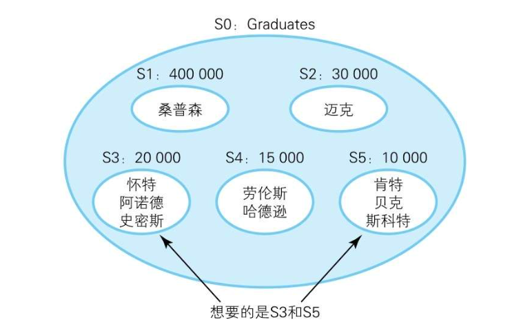
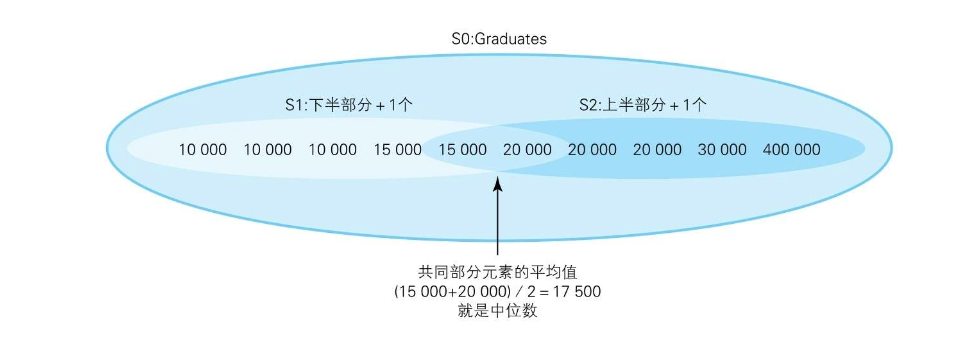
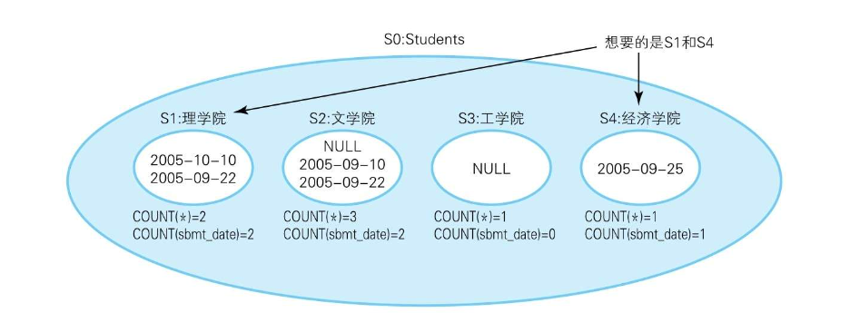
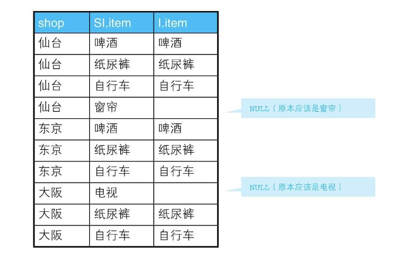

# 1-4 having子句

下面的SQL语句列出了每个国家的客户数量。只包括拥有5个以上客户的国家:

```mysql
SELECT COUNT(CustomerID), Country
FROM Customers
GROUP BY Country
HAVING COUNT(CustomerID) > 5;
```

## 寻找缺失的编号

```
+---+----+
|seq|name|
+---+----+
|1  |迪克  |
|2  |安   |
|3  |莱露  |
|5  |卡   |
|6  |玛丽  |
|8  |本   |
+---+----+
```

SQL会将多条记录作为一个集合来处理，因此如果将表整体看作一个集合，就可以像下面这样解决这个问题：

```SQL
select '*'
from seqtbl
having count(*) <> max(seq)
```

如果用集合论的语言来描述，那么这个查询所做的事情就是检查自然数集合和SeqTbl集合之间是否存在一一映射（又称双射）。

现在，我们已经知道这张表里存在缺失的编号了。接下来，再来查询一下缺失编号的最小值。求最小值要用MIN函数，因此我们像下面这样写SQL语句:

```SQL
SELECT MIN(seq + 1) AS gap
FROM SeqTbl
WHERE (seq + 1) NOT IN (SELECT seq FROM SeqTbl);
-- 得到的结果为 3 6 8 -> 4 7 9
```

## 用HAVING子句进行子查询：求众数

```
+----+------+
|name|income|
+----+------+
|劳伦斯 |15000 |
|史密斯 |20000 |
|哈德逊 |15000 |
|怀特  |20000 |
|斯科特 |10000 |
|桑普森 |400000|
|肯特  |10000 |
|贝克  |10000 |
|迈克  |30000 |
|阿诺德 |20000 |
+----+------+
```

从这个例子可以看出，简单地求平均值有一个缺点，那就是很容易受到离群值（outlier）的影响。这种时候就必须使用更能准确反映出群体趋势的指标——众数（mode）就是其中之一。

```SQL
select income, count(*) as cnt
from graduates
group by income
having count(*) >= all (select count(*) from graduates group by income)
-- all的作用是让count(*)与单个值进行比较

/*
+------+---+
|income|cnt|
+------+---+
|20000 |3  |
|10000 |3  |
+------+---+

*/
```

将收入（income）作为GROUP BY的列时，将得到S1～S5这样5个子集，如下图所示:



补充一点，1-3节提到过ALL谓词用于NULL或空集时会出现问题，可以用极值函数来代替。这里要求的是元素数最多的集合，因此可以用MAX函数。

```SQL
SELECT income, COUNT(*) AS cnt
FROM Graduates
GROUP BY income
HAVING COUNT(*) >= (SELECT MAX(cnt)
                    FROM (SELECT COUNT(*) AS cnt
                          FROM Graduates
                          GROUP BY income) TMP);
```

## 用HAVING子句进行自连接：求中位数

> todo: SQL看不懂???

[mysql如何用mysql计算每组的中位数](https://blog.csdn.net/weixin_37243717/article/details/79110730)

如果用SQL，该如何求中位数呢？像面向过程语言的处理方法那样排完序逐行比较，显然是不合理的。所以我们来思考一下如何用面向集合的方式，来查询位于集合正中间的元素。

做法是，将集合里的元素按照大小分为上半部分和下半部分两个子集，同时让这2个子集共同拥有集合正中间的元素。这样，共同部分的元素的平均值就是中位数，思路如下图所示。



```SQL
SELECT AVG(DISTINCT income)
FROM (SELECT T1.income
      FROM Graduates T1,
           Graduates T2
      GROUP BY T1.income

      HAVING SUM(CASE WHEN T2.income >= T1.income THEN 1 ELSE 0 END)
          >= COUNT(*) / 2
         AND SUM(CASE WHEN T2.income <= T1.income THEN 1 ELSE 0 END)
          >= COUNT(*) / 2) TMP;
```

这条SQL语句的要点在于比较条件`“>= COUNT(*)/2”`里的等号，这个等号是有意地加上的。加上等号并不是为了清晰地分开子集S1和S2，而是为了让这2个子集拥有共同部分。

## 查询不包含NULL的集合

COUNT函数的使用方法有COUNT（＊）和COUNT（列名）两种，它们的区别有两个：第一个是性能上的区别；第二个是COUNT（＊）可以用于NULL，而COUNT（列名）与其他聚合函数一样，要先排除掉NULL的行再进行统计。

```SQL
-- 在对包含NULL的列使用时，COUNT（＊）和COUNT（列名）的查询结果是不同的
SELECT COUNT(*), COUNT(col_1)
  FROM NullTbl;
```

例如，这里有一张存储了学生提交报告的日期的表Students，如下所示。

```
+----------+----+----------+
|student_id|dpt |sbmt_date |
+----------+----+----------+
|100       |理学院 |2005-10-10|
|101       |理学院 |2005-09-22|
|102       |文学院 |null      |
|103       |文学院 |2005-09-10|
|200       |文学院 |2005-09-22|
|201       |工学院 |null      |
|202       |经济学院|2005-09-25|
+----------+----+----------+
```

首先，以dpt groupby 生成如下的集合：



```SQL
-- 查询“提交日期”列内不包含NULL的学院(1)：使用COUNT函数
SELECT dpt
FROM Students
GROUP BY dpt
HAVING COUNT(*) = COUNT(sbmt_date);

-- 查询“提交日期”列内不包含NULL的学院(2)：使用CASE表达式
SELECT dpt
FROM Students
GROUP BY dpt
HAVING COUNT(*) = SUM(CASE WHEN sbmt_date IS NOT NULL THEN 1 ELSE 0 END);
```

在这里，CASE表达式的作用相当于进行判断的函数，用来判断各个元素（=行）是否属于满足了某种条件的集合。这样的函数我们称为特征函数（characteristic function），或者从定义了集合的角度来将它称为定义函数

## 用关系除法运算进行购物篮分析

> todo: SQL中的关系除法运算???

```
+----+
|item|
+----+
|啤酒  |
|纸尿裤 |
|自行车 |
+----+

+----+----+
|shop|item|
+----+----+
|东京  |啤酒  |
|东京  |纸尿裤 |
|东京  |自行车 |
|仙台  |啤酒  |
|仙台  |窗帘  |
|仙台  |纸尿裤 |
|仙台  |自行车 |
|大阪  |电视  |
|大阪  |纸尿裤 |
|大阪  |自行车 |
+----+----+

```

这次我们要查询的是囊括了表Items中所有商品的店铺。

遇到像表ShopItems这种一个实体（在这里是店铺）的信息分散在多行的情况时，仅仅在WHERE子句里通过OR或者IN指定条件是无法得到正确结果的。这是因为，在WHERE子句里指定的条件只对表里的某一行数据有效。

```SQL
-- 查询啤酒、纸尿裤和自行车同时在库的店铺：错误的SQL语句
SELECT DISTINCT shop
  FROM ShopItems
 WHERE item IN (SELECT item FROM Items);

-- 使用having子句
SELECT SI.shop
FROM ShopItems SI,
     Items I
WHERE SI.item = I.item
GROUP BY SI.shop
HAVING COUNT(SI.item) = (SELECT COUNT(item) FROM Items);
```

HAVING子句的子查询(SELECT COUNT(item) FROM Items)的返回值是常量3。

因此，对商品表和店铺的库存管理表进行连接操作后结果是3行的店铺会被选中；对没有啤酒的大阪店进行连接操作后结果是2行，所以大阪店不会被选中；而仙台店则因为（仙台，窗帘）的行在表连接时会被排除掉，所以也会被选中；另外，东京店则因为连接后结果是3行，所以当然也会被选中。

那么接下来我们把条件变一下，看看如何排除掉仙台店（仙台店的仓库中存在“窗帘”，但商品表里没有“窗帘”），让结果里只出现东京店。这类问题被称为“精确关系除法”（exact relational division），即只选择没有剩余商品的店铺（与此相对，前一个问题被称为“带余除法”（division with a remainder））。解决这个问题我们需要使用外连接。

```SQL
SELECT SI.shop
FROM ShopItems SI
         LEFT OUTER JOIN Items I ON SI.item = I.item
GROUP BY SI.shop
HAVING COUNT(SI.item) = (SELECT COUNT(item) FROM Items)
   AND COUNT(I.item) = (SELECT COUNT(item) FROM Items); 
```

以表ShopItems为主表进行外连接操作后，因为表Items里不存在窗帘和电视，所以连接后相应行的“I.item”列是NULL。



## 小结

1．表不是文件，记录也没有顺序，所以SQL不进行排序。

2．SQL不是面向过程语言，没有循环、条件分支、赋值操作。

3．SQL通过不断生成子集来求得目标集合。SQL不像面向过程语言那样通过画流程图来思考问题，而是通过画集合的关系图来思考。

4．GROUP BY子句可以用来生成子集。

5．WHERE子句用来调查集合元素的性质，而HAVING子句用来调查集合本身的性质。

