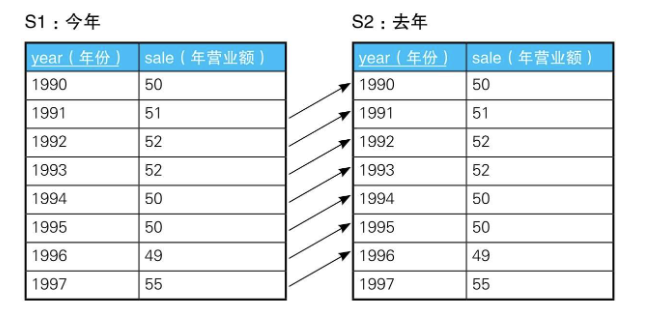
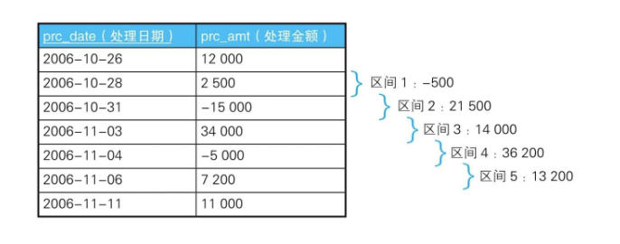
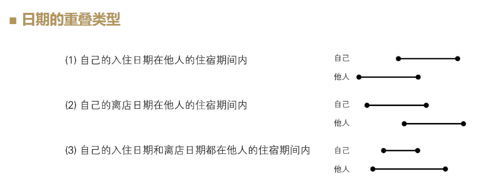

# 1-6 用关联子查询比较行与行

## 增长、减少、维持现状

需要用到行间数据比较的具有代表性的业务场景是，使用基于时间序列的表进行时间序列分析。假设有下面这样一张记录了某个公司每年的营业额的表Sales:

```
+----+----+
|year|sale|
+----+----+
|1990|50  |
|1991|51  |
|1992|52  |
|1993|52  |
|1994|50  |
|1995|50  |
|1996|49  |
|1997|55  |
+----+----+

```

请根据这张表里的数据，使用SQL输出与上一年相比营业额是增加了还是减少了，抑或是没有变化, 首先可以查出没有变化的年份：

```SQL
select s1.year, s1.sale
from sales s1
where s1.sale = (select s2.sale
                 from sales s2
                 where s2.year = s1.year - 1)
order by s1.year;

/*
+----+----+
|year|sale|
+----+----+
|1993|52  |
|1995|50  |
+----+----+

*/
```



```SQL
select s1.year, s1.sale, s2.year, s2.sale
from sales s1,
     sales s2
where s1.sale = s2.sale
  and s1.year = s2.year - 1
order by s1.year

/*
+----+----+----+----+
|year|sale|year|sale|
+----+----+----+----+
|1992|52  |1993|52  |
|1994|50  |1995|50  |
+----+----+----+----+

*/
```

### 用列表展示与上一年的比较结果

```SQL
SELECT S1.year,
       S1.sale,
       CASE
           WHEN sale =
                (SELECT sale
                 FROM Sales S2
                 WHERE S2.year = S1.year - 1) THEN '→'-- 持平
           WHEN sale >
                (SELECT sale
                 FROM Sales S2
                 WHERE S2.year = S1.year - 1) THEN '↑'-- 增长
           WHEN sale <
                (SELECT sale
                 FROM Sales S2
                 WHERE S2.year = S1.year - 1) THEN '↓'-- 减少
           ELSE '-' END AS var
FROM Sales S1
ORDER BY year;

/*
+----+----+---+
|year|sale|var|
+----+----+---+
|1990|50  |-  |
|1991|51  |↑  |
|1992|52  |↑  |
|1993|52  |→  |
|1994|50  |↓  |
|1995|50  |→  |
|1996|49  |↓  |
|1997|55  |↑  |
+----+----+---+

*/
```

```SQL
-- 求出是增长了还是减少了，抑或是维持现状(2)：使用自连接查询（最早的年份不会出现在结果里）
SELECT S1.year,
       S1.sale,
       CASE
           WHEN S1.sale = S2.sale THEN '→'
           WHEN S1.sale > S2.sale THEN '↑'
           WHEN S1.sale < S2.sale THEN '↓'
           ELSE '—' END AS var
FROM Sales S1,
     Sales S2
WHERE S2.year = S1.year - 1
ORDER BY year;
```

采用这种实现方法时，由于这里没有1990年之前的数据，所以1990年会被排除掉，执行结果会少一行。

### 时间轴有间断时：和过去最临近的时间进行比较

```
+----+----+
|year|sale|
+----+----+
|1990|50  |
|1992|50  |
|1993|52  |
|1994|55  |
|1997|55  |
+----+----+

```

我们需要把它扩展成更普遍的情况，用某一年的数据和它过去最临近的年份进行比较。

对某一年来说，“过去最临近的年份”需要满足下面两个条件。

1．与该年份相比是过去的年份。

2．在满足条件1的年份中，年份最早的一个。

```SQL
SELECT year, sale
FROM Sales2 S1
WHERE sale =
      (SELECT sale
       FROM Sales2 S2
       WHERE S2.year =
             (SELECT MAX(year) -- 条件2：在满足条件1的年份中，年份最早的一个
              FROM Sales2 S3
              WHERE S1.year > S3.year)) -- 条件1：与该年份相比是过去的年份
ORDER BY year;

-- 使用自连接
SELECT S1.year AS year,
       S1.sale AS sale
FROM Sales2 S1,
     Sales2 S2
WHERE S1.sale = S2.sale
  AND S2.year = (SELECT MAX(year)
                 FROM Sales2 S3
                 WHERE S1.year > S3.year)
ORDER BY year;
```

通过这个方法，我们可以查询每一年与过去最临近的年份之间的营业额之差：

```SQL
-- 求每一年与过去最临近的年份之间的营业额之差(1)：结果里不包含最早的年份
SELECT S2.year           AS pre_year,
       S1.year           AS now_year,
       S2.sale           AS pre_sale,
       S1.sale           AS now_sale,
       S1.sale - S2.sale AS diff
FROM Sales2 S1,
     Sales2 S2
WHERE S2.year = (SELECT MAX(year)
                 FROM Sales2 S3
                 WHERE S1.year > S3.year)
ORDER BY now_year;

/*
+--------+--------+--------+--------+----+
|pre_year|now_year|pre_sale|now_sale|diff|
+--------+--------+--------+--------+----+
|1990    |1992    |50      |50      |0   |
|1992    |1993    |50      |52      |2   |
|1993    |1994    |52      |55      |3   |
|1994    |1997    |55      |55      |0   |
+--------+--------+--------+--------+----+
*/

-- 求每一年与过去最临近的年份之间的营业额之差(2)：使用自外连接。结果里包含最早的年份
SELECT S2.year           AS pre_year,
       S1.year           AS now_year,
       S2.sale           AS pre_sale,
       S1.sale           AS now_sale,
       S1.sale - S2.sale AS diff
FROM Sales2 S1
         LEFT OUTER JOIN Sales2 S2
                         ON S2.year = (SELECT MAX(year)
                                       FROM Sales2 S3
                                       WHERE S1.year > S3.year)
ORDER BY now_year;

/*
+--------+--------+--------+--------+----+
|pre_year|now_year|pre_sale|now_sale|diff|
+--------+--------+--------+--------+----+
|null    |1990    |null    |50      |null|
|1990    |1992    |50      |50      |0   |
|1992    |1993    |50      |52      |2   |
|1993    |1994    |52      |55      |3   |
|1994    |1997    |55      |55      |0   |
+--------+--------+--------+--------+----+

*/
```

## 移动累计值和移动平均值

我们把截止到某个时间点且按时间记录的数值累加而得出来的数值称为累计值。

```
+----------+-------+
|prc_date  |prc_amt|
+----------+-------+
|2006-10-26|12000  |
|2006-10-28|2500   |
|2006-10-31|-15000 |
|2006-11-03|34000  |
|2006-11-04|-5000  |
|2006-11-06|7200   |
|2006-11-11|11000  |
+----------+-------+

```

使用窗口函数求累计值：

```SQL
select prc_date, prc_amt, sum(prc_amt) over (order by prc_date) as onhand_amt
from accounts;

/*
+----------+-------+----------+
|prc_date  |prc_amt|onhand_amt|
+----------+-------+----------+
|2006-10-26|12000  |12000     |
|2006-10-28|2500   |14500     |
|2006-10-31|-15000 |-500      |
|2006-11-03|34000  |33500     |
|2006-11-04|-5000  |28500     |
|2006-11-06|7200   |35700     |
|2006-11-11|11000  |46700     |
+----------+-------+----------+

*/
```

使用关联子查询：

```SQL
-- 求累计值：使用冯·诺依曼型递归集合
SELECT prc_date,
       A1.prc_amt,
       (SELECT SUM(prc_amt)
        FROM Accounts A2
        WHERE A1.prc_date >= A2.prc_date) AS onhand_amt
FROM Accounts A1
ORDER BY prc_date;
```

刚才的例题并没有指定要求的累计值的时间区间，因此我们计算的是从最早的数据开始的累计值。接下来，我们考虑一下如何以3次处理为单位求累计值，即移动累计值。所谓移动，指的是将累计的数据行数固定（本例中为3行），一行一行地偏移，如下表所示。



使用窗口函数的SQL如下：

```SQL
select prc_date,
       prc_amt,
       sum(prc_amt) over (order by prc_date rows 2 preceding) as onhand_amt
from accounts;
```

如果使用关联子查询，我们还可以像下面这样用标量子查询来计算行数:

```SQL
SELECT prc_date,
       A1.prc_amt,
       (SELECT SUM(prc_amt)
        FROM Accounts A2
        WHERE A1.prc_date >= A2.prc_date
          AND (SELECT COUNT(*)
               FROM Accounts A3
               WHERE A3.prc_date
                         BETWEEN A2.prc_date AND A1.prc_date) <= 3)
           AS mvg_sum
FROM Accounts A1
ORDER BY prc_date;
```

这条语句的要点是，A3.prc_date在以A2.prc_date为起点，以A1.prc_date为终点的区间内移动，请思考一下。通过修改“<= 3”里的数字，我们可以以任意行数为单位来进行偏移，比如以4行或5行为单位。在处理前2行时，即使数据不满3行，这条SQL语句还是计算出了相应的累计值。

```SQL
-- 移动累计值(3)：不满3行的区间按无效处理
SELECT prc_date,
       A1.prc_amt,
       (SELECT SUM(prc_amt)
        FROM Accounts A2
        WHERE A1.prc_date >= A2.prc_date
          AND (SELECT COUNT(*)
               FROM Accounts A3
               WHERE A3.prc_date
                         BETWEEN A2.prc_date AND A1.prc_date) <= 3
        HAVING COUNT(*) = 3) AS mvg_sum -- 不满3行数据的不显示
FROM Accounts A1
ORDER BY prc_date;

SELECT A1.prc_date AS A1_date,
       A1.prc_amt  AS A1_amt,
       A2.prc_date AS A2_date,
       A2.prc_amt  AS A2_amt
FROM Accounts A1,
     Accounts A2
WHERE A1.prc_date >= A2.prc_date
  and (select count(*) from accounts A3 where A3.prc_date between A2.prc_date and A1.prc_date) <= 3
```

## 查询重叠的时间区间

假设有下面这样一张表Reservations，记录了酒店或者旅馆的预约情况。

```
+--------+----------+----------+
|reserver|start_date|end_date  |
+--------+----------+----------+
|内田      |2006-11-03|2006-11-05|
|堀       |2006-10-31|2006-11-01|
|山本      |2006-11-03|2006-11-04|
|木村      |2006-10-26|2006-10-27|
|水谷      |2006-11-06|2006-11-06|
|荒木      |2006-10-28|2006-10-31|
+--------+----------+----------+

```



```SQL
-- 求重叠的住宿期间
SELECT reserver, start_date, end_date
FROM Reservations R1
WHERE EXISTS
          (SELECT *
           FROM Reservations R2
           WHERE R1.reserver <> R2.reserver -- 与自己以外的客人进行比较
             AND (R1.start_date BETWEEN R2.start_date AND R2.end_date -- 条件(1)：自己的入住日期在他人的住宿期间内
               OR R1.end_date BETWEEN R2.start_date AND R2.end_date)); -- 条件(2)：自己的离店日期在他人的住宿期间内
```

## 小结

1．作为面向集合语言，SQL在比较多行数据时，不进行排序和循环。

2．SQL的做法是添加比较对象数据的集合，通过关联子查询（或者自连接）一行一行地偏移处理。如果选用的数据库支持窗口函数，也可以考虑使用窗口函数。

3．求累计值和移动平均值的基本思路是使用冯·诺依曼型递归集合。

4．关联子查询的缺点是性能及代码可读性不好。

