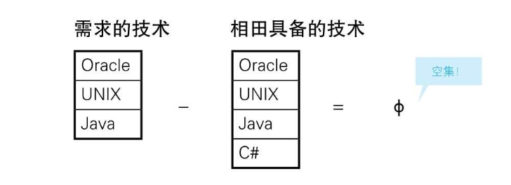
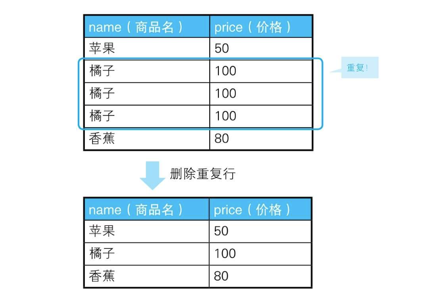

# 1-7 用SQL进行集合运算

## 开始

- SQL能操作具有重复行的集合，可以通过可选项ALL来支持

  一般的集合论是不允许集合里存在重复元素的，因此集合{1, 1, 2, 3, 3, 3}和集合{1,2, 3}被视为相同的集合。但是关系数据库里的表允许存在重复的行，称为多重集合（multiset, bag）。

  所以SQL里面对集合的操作可以分为 UNION 或者 UNION ALL 这两种形式。

- 集合运算符有优先级

  标准SQL规定，INTERSECT比UNION和EXCEPT优先级更高。

- 除法运算没有标准定义

  四则运算里的和（UNION）、差（EXCEPT）、积（CROSS JOIN）都被引入了标准SQL。但是 DIVIDE BY 没有被提供

## 检查集合相等性

在迁移数据库的时候，或者需要比较备份数据和最新数据的时候，我们需要调查两张表是否是相等的。这里说的“相等”指的是行数和列数以及内容都相同，即“是同一个集合”的意思。

```
+------+-----+-----+-----+
|keycol|col_1|col_2|col_3|
+------+-----+-----+-----+
|A     |2    |3    |4    |
|B     |0    |7    |9    |
|C     |5    |1    |6    |
+------+-----+-----+-----+

tbales: tbl_a tbl_b
```

那么可以使用UNION的原理来进行如下的查询：

```SQL
select count(*) as row_cnt
from (select *
      from tbl_a
      union
      select *
      from tbl_b) x
```

因此，如果表tbl_A和表tbl_B是相等的，排除掉重复行后，两个集合是完全重合的。对于任意的表S，都有下面的公式成立：`S UNION S = S`

有一点需要注意的是，如果改成对S执行多次UNION ALL操作，那么每次结果都会有变化，所以说UNION ALL不具有幂等性。类似地，如果对拥有重复行的表进行UNION操作，也会失去幂等性。

## 检查集合相等性2

第一种方法利用两个集合的包含关系来判定其相等性，意思是“如果集合A包含集合B，且集合B包含集合A，则集合A和集合B相等”。

第二种方法利用两个集合的并集和差集来判定其相等性。如果用SQL语言描述，那就是“如果A UNION B = A INTERSECT B，则集合A和集合B相等”。

在SQL中，我们可以对A和B分别进行UNION运算和INTERSECT运算后 比较这两个结果。只需要判定(A UNION B) EXCEPT (A INTERSECT B)的结果集是不是空集就可以了。

```SQL
-- 两张表相等时返回“相等”，否则返回“不相等”
SELECT CASE WHEN COUNT(*) = 0
            THEN '相等'
            ELSE '不相等' END AS result
  FROM ((SELECT * FROM  tbl_A
        UNION
        SELECT * FROM  tbl_B)
        EXCEPT
        (SELECT * FROM  tbl_A
        INTERSECT
        SELECT * FROM  tbl_B)) TMP;
```

UNION: 并集

INTERSECT: 交集

EXCEPT: 差集

那么，既然我们知道了两张表的数据有差异，接下来就把不同的行输出来看一看吧。diff命令是用来比较文件的，而这里的SQL语句就相当于diff，只不过是用来比较表的。我们只需要求出两个集合的异或集就可以了，代码如下所示。

```SQL
-- 用于比较表与表的diff
(SELECT * FROM  tbl_A
 EXCEPT
 SELECT * FROM  tbl_B)
UNION ALL
(SELECT * FROM  tbl_B
 EXCEPT
 SELECT * FROM  tbl_A);
```

## 用差集实现关系除法运算

1．嵌套使用NOT EXISTS。

2．使用HAVING子句转换成一对一关系。

3．把除法变成减法。

先有如下两张表：

```
+------+
|skill |
+------+
|Java  |
|Oracle|
|UNIX  |
+------+

+---+------+
|emp|skill |
+---+------+
|平井 |C++   |
|平井 |Oracle|
|平井 |Perl  |
|平井 |PHP   |
|平井 |UNIX  |
|渡来 |Oracle|
|相田 |C#    |
|相田 |Java  |
|相田 |Oracle|
|相田 |UNIX  |
|神崎 |Java  |
|神崎 |Oracle|
|神崎 |UNIX  |
|若田部|Perl  |
+---+------+
```

这里的问题是，从表EmpSkills中找出精通表Skills中所有技术的员工。也就是说，答案是相田和神崎。

```SQL
-- 用求差集的方法进行关系除法运算（有余数）
SELECT DISTINCT emp
  FROM EmpSkills ES1
 WHERE NOT EXISTS
        (SELECT skill
          FROM Skills
        EXCEPT
        SELECT skill
          FROM EmpSkills ES2
          WHERE ES1.emp = ES2.emp);
```

理解这段代码的要点在于EXCEPT运算符和关联子查询。关联子查询建立在表EmpSkills上，这是因为，我们要针对每个员工进行集合运算。即从需求的技术的集合中减去每个员工自己的技术的集合，如果结果是空集，则说明该员工具备所有的需求的技术，否则说明该员工不具备某些需求的技术。



关联子查询是为了使SQL能够实现类似面向过程语言中循环的功能而引入的

## 寻找相等的子集

表示“供应商-零件”关系的表作为示例数据：

```
+---+----+
|sup|part|
+---+----+
|A  |管子  |
|A  |螺丝  |
|A  |螺母  |
|B  |管子  |
|B  |螺丝  |
|C  |管子  |
|C  |螺丝  |
|C  |螺母  |
|D  |管子  |
|D  |螺丝  |
|E  |保险丝 |
|E  |管子  |
|E  |螺母  |
|F  |保险丝 |
+---+----+

```

我们需要求的是，经营的零件在种类数和种类上都完全相同的供应商组合。由上面的表格我们可以看出，答案是A-C和B-D这两组。

首先，我们来生成供应商的全部组合。方法是我们已经非常习惯了的非等值连接。使用聚合只是为了去除重复。

```SQL
select sp1.sup as s1, sp2.sup as s2
from supparts sp1,
     supparts sp2
where sp1.sup < sp2.sup
group by sp1.sup, sp2.sup;

/*
+--+--+
|s1|s2|
+--+--+
|A |B |
|A |C |
|A |D |
|A |E |
|A |F |
|B |C |
|B |D |
|B |E |
|B |F |
|C |D |
|C |E |
|C |F |
|D |E |
|D |F |
|E |F |
+--+--+
*/
```

需要检查是否满足一下条件：

条件1：两个供应商都经营同种类型的零件

条件2：两个供应商经营的零件种类数相同（即存在一一映射）

```SQL
SELECT SP1.sup AS s1, SP2.sup AS s2
FROM SupParts SP1,
     SupParts SP2
WHERE SP1.sup < SP2.sup   -- 生成供应商的全部组合
  AND SP1.part = SP2.part -- 条件1：经营同种类型的零件
GROUP BY SP1.sup, SP2.sup
HAVING COUNT(*) = (SELECT COUNT(*) -- 条件2：经营的零件种类数相同
                   FROM SupParts SP3
                   WHERE SP3.sup = SP1.sup)
   AND COUNT(*) = (SELECT COUNT(*)
                   FROM SupParts SP4
                   WHERE SP4.sup = SP2.sup);
```

如果我们把HAVING子句里的两个条件当成精确关系除法运算，就会很好理解。加上这两个条件后，我们就能保证集合A和集合B的元素个数一致，不会出现不足或者过剩（即存在一一映射）。而且，条件1又保证了经营的零件类型也都是完全相同的。这样就满足了本题的全部条件。

## 用于删除重复行的高效SQL



当时介绍的解法是使用关联子查询，代码非常简单。

```SQL
-- 删除重复行：使用关联子查询
DELETE FROM Products
 WHERE rowid < ( SELECT MAX(P2.rowid)
                  FROM Products P2
                  WHERE Products.name  = P2. name
                    AND Products.price = P2.price )
```

```SQL
-- 用于删除重复行的高效SQL语句(1)：通过EXCEPT求补集
DELETE FROM Products
 WHERE rowid IN ( SELECT rowid           -- 全部rowid
                    FROM Products
                  EXCEPT                 -- 减去
                  SELECT MAX(rowid)      -- 要留下的rowid
                    FROM Products
                  GROUP BY name, price);
                  
-- 删除重复行的高效SQL语句(2)：通过NOT IN求补集
DELETE FROM Products
 WHERE rowid NOT IN ( SELECT MAX(rowid)
                        FROM Products
                      GROUP BY name, price);
```

## 小结

1．在集合运算方面，SQL的标准化进行得比较缓慢，直到现在也是实现状况因数据库不同而参差不齐，因此使用的时候需要注意。

2．如果集合运算符不指定ALL可选项，重复行会被排除掉，而且，这种情况下还会发生排序，所以性能方面不够好。

3. UNION和INTERSECT都具有幂等性这一重要性质，而EXCEPT不具有幂等性。

4．标准SQL没有关系除法的运算符，需要自己实现。

5．判断两个集合是否相等时，可以通过幂等性或一一映射两种方法。

6．使用EXCEPT可以很简单地求得补集。

