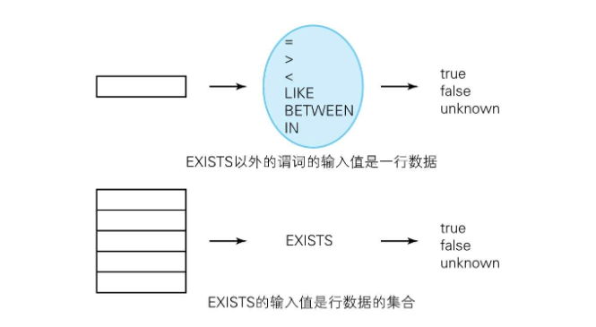

# 1-8 EXISTS的用法

支撑SQL和关系数据库的基础理论主要有两个：一个是数学领域的集合论，另一个是作为现代逻辑学标准体系的谓词逻辑（predicate logic）

## 理论

### 什么是谓词

SQL的保留字中，有很多都被归为谓词一类。例如，“=、<、>”等比较谓词，以及BETWEEN、LIKE、IN、IS NULL等。

谓词是一种特殊的函数，返回值是真值。前面提到的每个谓词，返回值都是true、false或者unknown.

谓词逻辑提供谓词是为了判断命题（可以理解成陈述句）的真假。

我们平时使用的WHERE子句，其实也可以看成是由多个谓词组合而成的新谓词。只有能让WHERE子句的返回值为真的命题，才能从表（命题的集合）中查询到。

### 实体的阶层

`x = y`或`x BETWEEN y`等谓词可以取的参数是像“13”或者“本田”这样的单一值，我们称之为标量值。

`EXISTS` 的参数是行数据的集合。



EXISTS的特殊性在于输入值的阶数。

谓词逻辑中，根据输入值的阶数对谓词进行分类。

=或者BETWEEEN等输入值为一行的谓词叫作“一阶谓词”，

而像EXISTS这样输入值为行的集合的谓词叫作“二阶谓词”。

### 全称量化和存在量化

我们可以用它们来表达一些这样的命题：“所有的x都满足条件P”或者“存在（至少一个）满足条件P的x”。前者称为“全称量词”，后者称为“存在量词”，分别记作∀、∃。

SQL中的EXISTS谓词实现了谓词逻辑中的存在量词。

全称量词和存在量词只要定义了一个，另一个就可以被推导出来。具体可以参考下面这个等价改写的规则（德·摩根定律）：

- 所有的x都满足条件P＝不存在不满足条件P的x
- 存在x满足条件P＝并非所有的x都不满足条件P

## 实践

### 查询表中“不”存在的数据

```
+-------+------+
|meeting|person|
+-------+------+
|第1次    |伊藤    |
|第1次    |坂东    |
|第1次    |水岛    |
|第2次    |伊藤    |
|第2次    |宫田    |
|第3次    |坂东    |
|第3次    |宫田    |
|第3次    |水岛    |
+-------+------+

table: meetings
```

从这张表中求出 “没有参加某次会议的人” 例如，伊藤参加了第1次会议和第2次会议，但是没有参加第3次会议；坂东没有参加第2次会议。

思路是先假设所有人都参加了全部会议，并以此生成一个集合，然后从中减去实际参加会议的人。这样就能得到缺席会议的人。

1, 参加了全部会议的集合可以通过下面这样的交叉连接来求得。

```SQL
select distinct m1.meeting, m2.person
from meetings m1 cross join meetings m2;

/*
第1次,伊藤
第1次,坂东
第1次,水岛
第1次,宫田
第2次,伊藤
第2次,坂东
第2次,水岛
第2次,宫田
第3次,伊藤
第3次,坂东
第3次,水岛
第3次,宫田


*/
```

2, 从这个结果集合中减去实际参与会议的集合

```SQL
select distinct m1.meeting, m2.person
from meetings m1
         cross join meetings m2
where not exists(
        select *
        from meetings m3
        where m1.meeting = m3.meeting
          and m2.person = m3.person
    );
    
/*
+-------+------+
|meeting|person|
+-------+------+
|第3次    |伊藤    |
|第2次    |坂东    |
|第2次    |水岛    |
|第1次    |宫田    |
+-------+------+


*/
```

另外还可以用集合论的方法来解答：

```SQL
-- 求出缺席者的SQL语句(2)：使用差集运算
SELECT M1.meeting, M2.person
  FROM Meetings M1, Meetings M2
EXCEPT
SELECT meeting, person
  FROM Meetings;
```

#### 全称量化(1)，习惯“肯定⇔双重否定”之间的转换

这里使用下面这样一张存储了学生考试成绩的表为例进行讲解。

```
+----------+-------+-----+
|student_id|subject|score|
+----------+-------+-----+
|100       |数学     |100  |
|100       |理化     |80   |
|100       |语文     |80   |
|200       |数学     |80   |
|200       |语文     |95   |
|300       |数学     |40   |
|300       |社会     |55   |
|300       |语文     |90   |
|400       |数学     |80   |
+----------+-------+-----+

table: testscores
```

请查询出“所有科目分数都在50分以上的学生”。答案是学号分别为100、200、400的3人。

解法是，将查询条件“所有科目分数都在50分以上”转换成它的双重否定“没有一个科目分数不满50分”，然后用NOT EXISTS来表示转换后的命题。

```SQL
select distinct student_id -- 用于去重
from testscores ts1
where not exists(
        select *
        from testscores ts2
        where ts2.student_id = ts1.student_id
          and ts2.score < 50
    )

-- chatgpt给出的答案
select student_id
from testscores
group by student_id
having min(score) >= 50;
```

**第二个条件**

1．数学的分数在80分以上。

2．语文的分数在50分以上。

解释：某个学生的所有行数据中，如果科目是数学，则分数在80分以上；如果科目是语文，则分数在50分以上。

针对同一个集合内的行数据进行了条件分支后的全称量化。

```MYSQL
SELECT DISTINCT
    student_id
FROM
    TestScores TS1
WHERE
    subject IN ('数学' , '语文')
        AND NOT EXISTS( SELECT 
            *
        FROM
            TestScores TS2
        WHERE
            TS2.student_id = TS1.student_id
                AND 1 = CASE
                WHEN subject = '数学' AND score < 80 THEN 1
                WHEN subject = '语文' AND score < 50 THEN 1
                ELSE 0
            END);
```

```MySQL
SELECT DISTINCT
    TS1.student_id
FROM
    TestScores TS1
WHERE
    TS1.subject IN ('数学', '语文')
        AND NOT EXISTS (
            SELECT *
            FROM TestScores TS2
            WHERE TS2.student_id = TS1.student_id
                AND (
                    (TS2.subject = '数学' AND TS2.score < 80)
                    OR (TS2.subject = '语文' AND TS2.score < 50)
                )
        );

```

#### 全称量化(2)：集合VS谓词

EXISTS和HAVING有一个地方很像，即都是以集合而不是个体为单位来操作数据。

