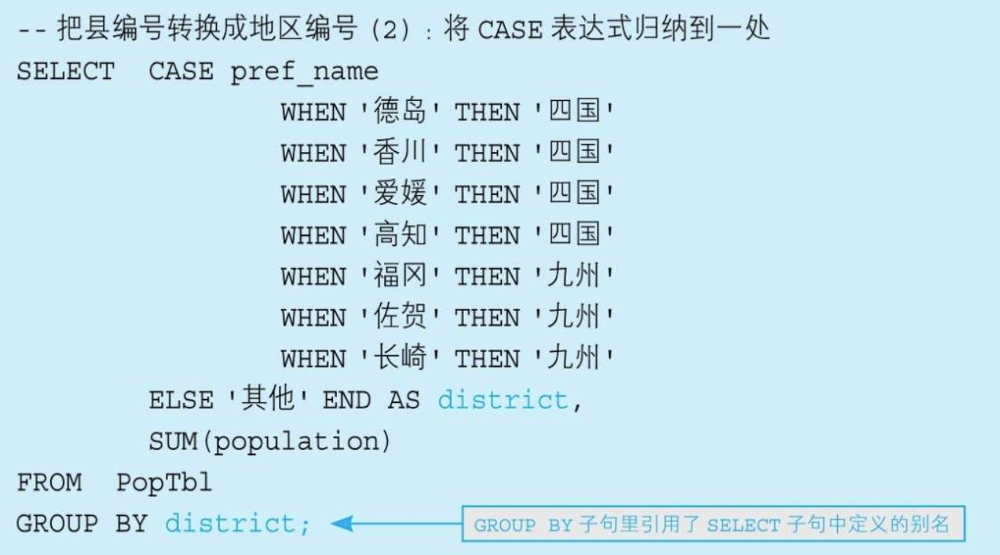

# CASE 语句的用法

case表达式从SQL92标准引入。

> todo: in和exists的区别

## CASE表达式概述

CASE表达式有简单CASE表达式（simple case expression）和搜索CASE表达式（searched case expression）两种写法.

> TODO: 简单case和搜索case的区别???

```sql
--简单CASE表达式
CASE sex
  WHEN '1' THEN ’男’
  WHEN '2' THEN ’女’
ELSE ’其他’ END

--搜索CASE表达式
CASE WHEN sex ='1'THEN’男’
    WHEN sex ='2'THEN’女’
ELSE ’其他’ END
```

在编写SQL语句的时候需要注意，在发现为真的WHEN子句时，CASE表达式的真假值判断就会中止，而剩余的WHEN子句会被忽略。

使用CASE时需要注意：

- 任何分支的返回类型需要统一。
- 不要忘记写 `END`
- 与END不同，ELSE子句是可选的，不写也不会出错。不写ELSE子句时，CASE表达式的执行结果是NULL。

## 将已有编号方式转换为新的方式并统计

在进行非定制化统计时，我们经常会遇到将已有编号方式转换为另外一种便于分析的方式并进行统计的需求。

demo1, 例如现在有一张表要转换为按各个地区的方式来统计：

```
+---------+----------+
|pref_name|population|
+---------+----------+
|东京       |400       |
|佐贺       |100       |
|德岛       |100       |
|爱媛       |150       |
|福冈       |300       |
|群马       |50        |
|长崎       |200       |
|香川       |200       |
|高知       |200       |
+---------+----------+

table name: PopTbl
```

```
+--------+---------------+
|district|SUM(population)|
+--------+---------------+
|其他      |450            |
|九州      |600            |
|四国      |650            |
+--------+---------------+
```

使用CASE语句，将县名的条件按地区来区分：

```SQL
SELECT 
    CASE pref_name
        WHEN '德岛' THEN '四国'
        WHEN '香川' THEN '四国'
        WHEN '爱媛' THEN '四国'
        WHEN '高知' THEN '四国'
        WHEN '福冈' THEN '九州'
        WHEN '佐贺' THEN '九州'
        WHEN '长崎' THEN '九州'
        ELSE '其他'
    END AS district,
    SUM(population)
FROM
    poptbl
GROUP BY CASE pref_name
    WHEN '德岛' THEN '四国'
    WHEN '香川' THEN '四国'
    WHEN '爱媛' THEN '四国'
    WHEN '高知' THEN '四国'
    WHEN '福冈' THEN '九州'
    WHEN '佐贺' THEN '九州'
    WHEN '长崎' THEN '九州'
    ELSE '其他'
END;
```

这里的关键在于将SELECT子句里的CASE表达式复制到GROUP BY子句里。需要注意的是，如果对转换前的列“pref_name”进行GROUP BY，就得不到正确的结果（因为这并不会引起语法错误，所以容易被忽视）。

demo2, 也可以按人口数量等级来进行区分：

```SQL
SELECT 
    CASE
        WHEN population < 100 THEN '01'
        WHEN population >= 100 AND population < 200 THEN '02'
        WHEN population >= 200 AND population < 300 THEN '03'
        WHEN population >= 300 THEN '04'
        ELSE NULL
    END AS pop_class,
    COUNT(*) AS cnt
FROM
    poptbl
GROUP BY CASE
    WHEN population < 100 THEN '01'
    WHEN population >= 100 AND population < 200 THEN '02'
    WHEN population >= 200 AND population < 300 THEN '03'
    WHEN population >= 300 THEN '04'
    ELSE NULL
END;
```

在这两个SQL中，我们的GROUP BY 的写法必须和CASE的写法一样，但是在MySQL和postgresql中可以用如下写法(非标准SQL)：

但是严格来说，这种写法是违反标准SQL的规则的。因为GROUP BY子句比SELECT语句先执行，所以在GROUP BY子句中引用在SELECT子句里定义的别称是不被允许的。



```mysql
SELECT 
    CASE
        WHEN population < 100 THEN '01: 小于100'
        WHEN population >= 100 AND population < 200 THEN '02: 在100到200之间'
        WHEN population >= 200 AND population < 300 THEN '03: 在200到300之间'
        WHEN population >= 300 THEN '04: 大于等于300'
        ELSE NULL
    END AS pop_class,
    COUNT(*) AS cnt
FROM
    PopTbl
GROUP BY pop_class
```

## 用一条SQL语句进行不同条件的统计

例如，我们需要往存储各县人口数量的表PopTbl里添加上“性别”列，然后求按性别、县名汇总的人数。

```
+---------+---+----------+
|pref_name|sex|population|
+---------+---+----------+
|东京       |1  |250       |
|东京       |2  |150       |
|佐贺       |1  |20        |
|佐贺       |2  |80        |
|德岛       |1  |60        |
|德岛       |2  |40        |
|爱媛       |1  |100       |
|爱媛       |2  |50        |
|福冈       |1  |100       |
|福冈       |2  |200       |
|长崎       |1  |125       |
|长崎       |2  |125       |
|香川       |1  |100       |
|香川       |2  |100       |
|高知       |1  |100       |
|高知       |2  |100       |
+---------+---+----------+

tablename: poptbl2
```

```
+---------+-------+---------+
|pref_name|Man Pop|Women Pop|
+---------+-------+---------+
|东京       |250    |150      |
|佐贺       |20     |80       |
|德岛       |60     |40       |
|爱媛       |100    |50       |
|福冈       |100    |200      |
|长崎       |125    |125      |
|香川       |100    |100      |
|高知       |100    |100      |
+---------+-------+---------+
```

使用case表达式和聚合函数来使用：

```SQL
SELECT 
    pref_name,
    SUM(CASE
        WHEN sex = '1' THEN population
        ELSE 0
    END) AS 'Man Pop',
    SUM(CASE
        WHEN sex = '2' THEN population
        ELSE 0
    END) AS 'Women Pop'
FROM
    poptbl2
GROUP BY pref_name
```

这里是将“行结构”的数据转换成了“列结构”的数据。除了SUM, COUNT、AVG等聚合函数也都可以用于将行结构的数据转换成列结构的数据。

这个技巧可贵的地方在于，它能将SQL的查询结果转换为二维表的格式。

新手用WHERE子句进行条件分支，高手用**SELECT子句**进行条件分支。

## 用CHECK约束定义多个列的条件关系

其实，CASE表达式和CHECK约束是很般配的一对组合。

假设某公司规定“女性员工的工资必须在20万日元以下” ,那么可以使用如下SQL:

```SQL
CONSTRAINT check_salary CHECK
          ( CASE WHEN sex ='2'
                  THEN CASE WHEN salary <= 200000
                          THEN 1 ELSE 0 END
                  ELSE 1 END = 1 )
```

这个命题也称为蕴含式（conditional）的逻辑表达式，记作 P→Q

还有一种逻辑与的表达式，但是意思完全不一样：

```SQL
CONSTRAINT check_salary CHECK
          ( sex ='2'AND salary <= 200000 )
```

如果在CHECK约束里使用逻辑与，该公司将不能雇佣男性员工。而如果使用蕴含式，男性也可以在这里工作。

而要想让蕴含式P→Q为真，需要命题P和命题Q均为真，或者P为假，或者P无法判定真假。也就是说如果不满足“是女性”这个前提条件，则无需考虑工资约束。

## 在update语句进行台条件分支

这样一种需求：以某数值型的列的当前值为判断对象，将其更新成别的值。这里的问题是，此时UPDATE操作的条件会有多个分支。

```
+----+------+
|name|salary|
+----+------+
|木村  |220000|
|相田  |300000|
|神崎  |270000|
|齐藤  |290000|
+----+------+

table_name: salaries
```

假设现在需要根据以下条件对该表的数据进行更新。

1．对当前工资为30万日元以上的员工，降薪10%。

2．对当前工资为25万日元以上且不满28万日元的员工，加薪20%。

```sql
UPDATE salaries 
SET 
    salary = CASE
        WHEN salary >= 300000 THEN salary * 0.9
        WHEN salary >= 250000 AND salary < 280000 THEN salary * 1.2
        ELSE salary
    END
```

需要注意的是，SQL语句最后一行的ELSE salary非常重要，必须写上。因为如果没有它，条件1和条件2都不满足的员工的工资就会被更新成NULL。

### 主键调换

可以用它简单地完成主键值调换这种繁重的工作。

通常，当我们想调换主键值a和b时，需要将主键值临时转换成某个中间值，但是使用CASE就不需要使用临时值

```
+-----+-----+-----+
|p_key|col_1|col_2|
+-----+-----+-----+
|a    |1    |一    |
|b    |2    |二    |
|c    |3    |三    |
+-----+-----+-----+
```

```sql
UPDATE sometable 
SET 
    p_key = CASE
        WHEN p_key = 'a' THEN 'b'
        WHEN p_key = 'b' THEN 'a'
        ELSE p_key
    END
WHERE
    p_key IN ('a' , 'b')
    
Error Code: 1062. Duplicate entry 'b' for key 'sometable.PRIMARY'
```

## 表之间的数据匹配

在CASE表达式里，我们可以使用BETWEEN、LIKE和<、>等便利的谓词组合，以及能嵌套子查询的IN和EXISTS谓词。

如下所示，这里有一张资格培训学校的课程一览表和一张管理每个月所设课程的表：

```
+---------+-----------+
|course_id|course_name|
+---------+-----------+
|1        |会计入门       |
|2        |财务知识       |
|3        |簿记考试       |
|4        |税务师        |
+---------+-----------+

table: courseMaster

+------+---------+
|month |course_id|
+------+---------+
|200706|1        |
|200706|3        |
|200706|4        |
|200707|4        |
|200708|2        |
|200708|4        |
+------+---------+

table: openCourse
```

我们需要做的是，检查表OpenCourses中的各月里有表CourseMaster中的哪些课程。这个匹配条件可以用CASE表达式来写。

```SQL
-- 表的匹配：使用IN谓词
SELECT course_name,
      CASE WHEN course_id IN
                    (SELECT course_id FROM OpenCourses
                      WHERE month = 200706) THEN'○'
            ELSE'×'END AS "6月",
      CASE WHEN course_id IN
                    (SELECT course_id FROM OpenCourses
                      WHERE month = 200707) THEN'○'
            ELSE'×'END AS "7月",
      CASE WHEN course_id IN
                    (SELECT course_id FROM OpenCourses
                      WHERE month = 200708) THEN'○'
            ELSE'×'END  AS "8月"
  FROM CourseMaster;


-- 表的匹配：使用EXISTS谓词
SELECT CM.course_name,
      CASE WHEN EXISTS
                    (SELECT course_id FROM OpenCourses OC
                      WHERE month = 200706

                          AND OC.course_id = CM.course_id) THEN'○'
              ELSE'×'END AS "6月",
          CASE WHEN EXISTS
                      (SELECT course_id FROM OpenCourses OC
                        WHERE month = 200707
                          AND OC.course_id = CM.course_id) THEN'○'
              ELSE'×'END AS "7月",
          CASE WHEN EXISTS
                      (SELECT course_id FROM OpenCourses OC
                        WHERE month = 200708
                          AND OC.course_id = CM.course_id) THEN'○'
              ELSE'×'END  AS "8月"
    FROM CourseMaster CM;
```

无论使用IN还是EXISTS，得到的结果是一样的，但从性能方面来说，EXISTS更好。

通过EXISTS进行的子查询能够用到“month, course_id”这样的主键索引，因此尤其是当表OpenCourses里数据比较多的时候更有优势。

## 在CASE表达式中使用聚合函数

