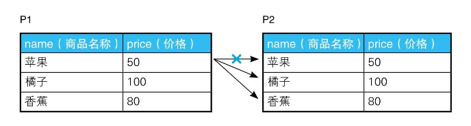

# 1-2 自连接的用法

理解自连接不仅可以让我们学会实际工作中能用到的技能，还能增进我们对“面向集合”这一SQL语言重要特征的理解。面向对象语言以对象的方式来描述世界，而面向集合语言SQL以集合的方式来描述世界。自连接技术充分体现了SQL面向集合的特性，相信大家在读完本节后再看二维表状的表格时，就会觉得这种表格更像是集合。

## 可重排列 排列 组合

> todo: mysql join

假设这里有一张存放了商品名称及价格的表，表里有“苹果、橘子、香蕉”这3条记录。

```
+----+-----+
|name|price|
+----+-----+
|橘子  |100  |
|苹果  |50   |
|香蕉  |80   |
+----+-----+

table: products
```

这里所说的组合其实分为两种类型: 一种是有顺序的有序对（ordered pair），另一种是无顺序的无序对（unordered pair）。有序对用尖括号括起来，如<1,2>；无序对用花括号括起来，如{1, 2}。

这两类分别对应着“排列”和“组合”。

1，用SQL生成有序对非常简单：

```SQL
SELECT 
    p1.name AS name_1, p2.name AS name_2
FROM
    products p1,
    products p2;
    
/*
+------+------+
|name_1|name_2|
+------+------+
|橘子    |橘子    |
|苹果    |橘子    |
|香蕉    |橘子    |
|橘子    |苹果    |
|苹果    |苹果    |
|香蕉    |苹果    |
|橘子    |香蕉    |
|苹果    |香蕉    |
|香蕉    |香蕉    |
+------+------+
*/
```

2，排除掉由相同元素构成的对：

```SQL
SELECT 
    p1.name AS name_1, p2.name AS name_2
FROM
    products p1,
    products p2
WHERE
    p1.name <> p2.name

/*
+------+------+
|name_1|name_2|
+------+------+
|苹果    |橘子    |
|香蕉    |橘子    |
|橘子    |苹果    |
|香蕉    |苹果    |
|橘子    |香蕉    |
|苹果    |香蕉    |
+------+------+
*/
```

这个SQL的原理如下：



3，对（苹果，橘子）和（橘子，苹果）这样只是调换了元素顺序的对进行去重：

```SQL
SELECT 
    p1.name AS name_1, p2.name AS name_2
FROM
    products p1,
    products p2
WHERE
    p1.name > p2.name

/*
+------+------+
|name_1|name_2|
+------+------+
|苹果    |橘子    |
|香蕉    |橘子    |
|香蕉    |苹果    |
+------+------+

*/
```

使用等号“＝”以外的比较运算符，如“<、>、<>”进行的连接称为“非等值连接”。这里将非等值连接与自连接结合使用了，因此称为“非等值自连接”。

## 删除重复行

