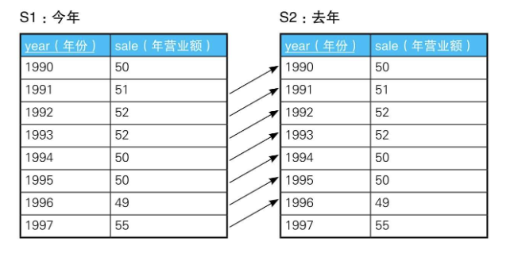

# 1-6 用关联子查询比较行与行

## 增长、减少、维持现状

需要用到行间数据比较的具有代表性的业务场景是，使用基于时间序列的表进行时间序列分析。假设有下面这样一张记录了某个公司每年的营业额的表Sales:

```
+----+----+
|year|sale|
+----+----+
|1990|50  |
|1991|51  |
|1992|52  |
|1993|52  |
|1994|50  |
|1995|50  |
|1996|49  |
|1997|55  |
+----+----+

```

请根据这张表里的数据，使用SQL输出与上一年相比营业额是增加了还是减少了，抑或是没有变化, 首先可以查出没有变化的年份：

```SQL
select s1.year, s1.sale
from sales s1
where s1.sale = (select s2.sale
                 from sales s2
                 where s2.year = s1.year - 1)
order by s1.year;

/*
+----+----+
|year|sale|
+----+----+
|1993|52  |
|1995|50  |
+----+----+

*/
```



```SQL
select s1.year, s1.sale, s2.year, s2.sale
from sales s1,
     sales s2
where s1.sale = s2.sale
  and s1.year = s2.year - 1
order by s1.year

/*
+----+----+----+----+
|year|sale|year|sale|
+----+----+----+----+
|1992|52  |1993|52  |
|1994|50  |1995|50  |
+----+----+----+----+

*/
```

### 用列表展示与上一年的比较结果

```SQL
SELECT S1.year,
       S1.sale,
       CASE
           WHEN sale =
                (SELECT sale
                 FROM Sales S2
                 WHERE S2.year = S1.year - 1) THEN '→'-- 持平
           WHEN sale >
                (SELECT sale
                 FROM Sales S2
                 WHERE S2.year = S1.year - 1) THEN '↑'-- 增长
           WHEN sale <
                (SELECT sale
                 FROM Sales S2
                 WHERE S2.year = S1.year - 1) THEN '↓'-- 减少
           ELSE '-' END AS var
FROM Sales S1
ORDER BY year;

/*
+----+----+---+
|year|sale|var|
+----+----+---+
|1990|50  |-  |
|1991|51  |↑  |
|1992|52  |↑  |
|1993|52  |→  |
|1994|50  |↓  |
|1995|50  |→  |
|1996|49  |↓  |
|1997|55  |↑  |
+----+----+---+

*/
```

```SQL
-- 求出是增长了还是减少了，抑或是维持现状(2)：使用自连接查询（最早的年份不会出现在结果里）
SELECT S1.year,
       S1.sale,
       CASE
           WHEN S1.sale = S2.sale THEN '→'
           WHEN S1.sale > S2.sale THEN '↑'
           WHEN S1.sale < S2.sale THEN '↓'
           ELSE '—' END AS var
FROM Sales S1,
     Sales S2
WHERE S2.year = S1.year - 1
ORDER BY year;
```

采用这种实现方法时，由于这里没有1990年之前的数据，所以1990年会被排除掉，执行结果会少一行。

### 时间轴有间断时：和过去最临近的时间进行比较

