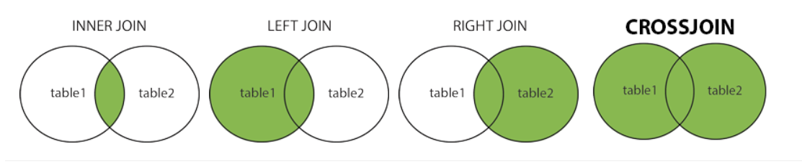
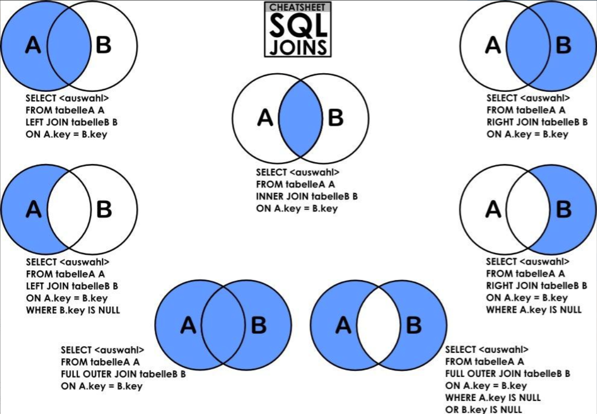

# Mysql Joins

- `INNER JOIN`: Returns records that have matching values in both tables
- `LEFT JOIN`: Returns all records from the left table, and the matched records from the right table
- `RIGHT JOIN`: Returns all records from the right table, and the matched records from the left table
- `CROSS JOIN`: Returns all records from both tables

