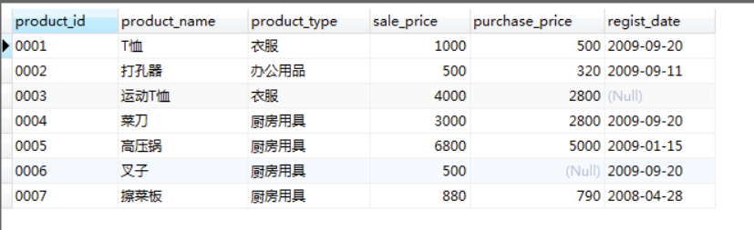

# 关联子查询

## 正常查询的流程

select的书写顺序：

```
select -> from -> where -> group by -> having -> order by
```

select的执行顺序：

```
FROM -> WHERE -> GROUP BY -> HAVE -> SELECT -> ORDER BY
```

## 关联子查询的流程



以下“选取出各商品种类中高于该商品种类的平均销售单价的商品。” 的关联子查询SELECT语句：

```SQL
select product_type, product_name, sale_price
from product p1
where sale_price > (select avg(sale_price) from product p2 where p1.product_type = p2.product_type group by product type)
```

关联子查询的执行过程：

1, 先执行主查询

```SQL
SELECT product_type , product_name, sale_price
FROM Product AS P1
```

2, 从主查询的product_type先取第一行的值，传入到子查询中的where条件：

```SQL
SELECT AVG(sale_price)
FROM Product AS P2
WHERE P2.product_type = '衣服'
GROUP BY product_type
```

从而得到一个查询结果为 sale_price的平均值 2500

将该结果返回主查询：

```SQL
SELECT product_type , product_name, sale_price
FROM Product AS P1
WHERE sale_price > 2500 AND product_type = '衣服'
```

此时第一行满足这个条件所以这一行会被保留。

3, 然后从主表取第二行的product_type的值，进行如上的操作，直到主表所有的行都被遍历。

