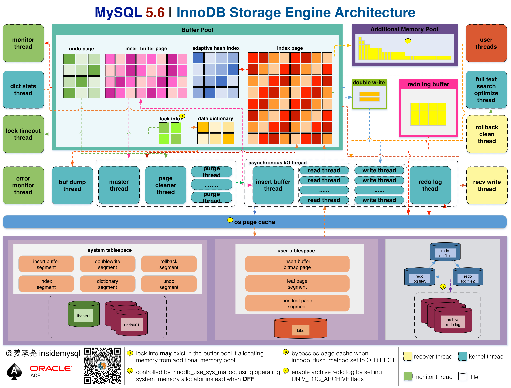

# InnoDB 存储引擎

## 1. mysql体系结构和存储引擎

通过 `show engines` 或者 `information_schema.ENGINES` 来查看mysql支持的存储引擎：

```
 MySQL  localhost:33060+ ssl  SQL > show engines;
+--------------------+---------+----------------------------------------------------------------+--------------+------+------------+
| Engine             | Support | Comment                                                        | Transactions | XA   | Savepoints |
+--------------------+---------+----------------------------------------------------------------+--------------+------+------------+
| MEMORY             | YES     | Hash based, stored in memory, useful for temporary tables      | NO           | NO   | NO         |
| MRG_MYISAM         | YES     | Collection of identical MyISAM tables                          | NO           | NO   | NO         |
| CSV                | YES     | CSV storage engine                                             | NO           | NO   | NO         |
| FEDERATED          | NO      | Federated MySQL storage engine                                 | NULL         | NULL | NULL       |
| PERFORMANCE_SCHEMA | YES     | Performance Schema                                             | NO           | NO   | NO         |
| MyISAM             | YES     | MyISAM storage engine                                          | NO           | NO   | NO         |
| InnoDB             | DEFAULT | Supports transactions, row-level locking, and foreign keys     | YES          | YES  | YES        |
| BLACKHOLE          | YES     | /dev/null storage engine (anything you write to it disappears) | NO           | NO   | NO         |
| ARCHIVE            | YES     | Archive storage engine                                         | NO           | NO   | NO         |
+--------------------+---------+----------------------------------------------------------------+--------------+------+------------+
9 rows in set (0.0004 sec)
```

## 2. InnoDB存储引擎

show engine innodb status 解释：

```
I/O thread 0 state: IO thread 状态
Buffer pool size   512  : 缓冲池的大小 512 * 16k
Free buffers       241  : free列表中的页  241 * 16k
Database pages     264  : LRU列表中页的数量 264 * 16k

Pages made young 0, not young 0
0.00 youngs/s, 0.00 non-youngs/s    

Buffer pool hit rate   : 缓冲池的命中率

LRU len: 264, unzip_LRU len: 0  : unzip_LRU 压缩页

Modified db pages  0    : 脏页的数量


Log sequence number          377257329     : LSN 
Log buffer assigned up to    377257329
Log buffer completed up to   377257329
Log written up to            377257329
Log flushed up to            377257329
Added dirty pages up to      377257329
Pages flushed up to          377257329
Last checkpoint at           377257329

srv_master_thread loops: 114 srv_active, 0 srv_shutdown, 100732 srv_idle  # 主循环的状态
srv_master_thread log flush and writes: 0


Ibuf: size 1, free list len 0, seg size 2, 0 merges : 插入缓冲的状态, seg size 插入缓冲的大小 2 * 16kb

merged operations:                                  : 合并插入缓冲的信息
 insert 0, delete mark 0, delete 0
discarded operations:
 insert 0, delete mark 0, delete 0

Hash table size 2267, node heap has 1 buffer(s)  哈希索引的大小，使用情况。
0.00 hash searches/s, 0.00 non-hash searches/s  
```

### 2.3 innodb体系架构



#### 2.3.1 后台线程

刷新内存池中的数据，将已经修改的数据文件刷新到磁盘文件。

**Master Thread**

将缓冲池数据异步刷新到磁盘，保证数据的一致性，包括脏页的刷新，合并插入缓冲 insert buffer , undo页的回收

**IO Thread**

负责IO请求的回调处理。有四个IO thread，分别是 write，read, insert buffer 和 log 。

下面是相关的参数：

```
SQL > show variables like 'innodb_version';
+----------------+--------+
| Variable_name  | Value  |
+----------------+--------+
| innodb_version | 8.0.20 |
+----------------+--------+

SQL > show variables like 'innodb_%_io_threads';
+-------------------------+-------+
| Variable_name           | Value |
+-------------------------+-------+
| innodb_read_io_threads  | 4     |
| innodb_write_io_threads | 4     |
+-------------------------+-------+
```

可以通过 `show engine innodb status` 来观察IO thread.

```
--------
FILE I/O
--------
I/O thread 0 state: wait Windows aio (insert buffer thread)
I/O thread 1 state: wait Windows aio (log thread)
I/O thread 2 state: wait Windows aio (read thread)
I/O thread 3 state: wait Windows aio (read thread)
I/O thread 4 state: wait Windows aio (read thread)
I/O thread 5 state: wait Windows aio (read thread)
I/O thread 6 state: wait Windows aio (write thread)
I/O thread 7 state: wait Windows aio (write thread)
I/O thread 8 state: wait Windows aio (write thread)
I/O thread 9 state: wait Windows aio (write thread)
Pending normal aio reads: [0, 0, 0, 0] , aio writes: [0, 0, 0, 0] ,
 ibuf aio reads:, log i/o's:, sync i/o's:
Pending flushes (fsync) log: 0; buffer pool: 0
2525 OS file reads, 3473 OS file writes, 1743 OS fsyncs
0.00 reads/s, 0 avg bytes/read, 0.00 writes/s, 0.00 fsyncs/s
-------------------------------------
```

**Purge Thread**

回收已经使用并分配的undo页，相关配置：

```mysql
show variables like 'innodb_purge%';
```

**Page Cleaner Thread**

脏页的刷新操作都放入到单独的线程中来完成。

#### 2.3.2 内存

**缓冲池**

缓冲池的配置参数： `innodb_buffer_pool_size` 单位为kb。

缓冲池的实例个数配置： `innodb_buffer_pool_instances`

查看缓冲池状态: `information_schema.INNODB_BUFFER_POOL_STATS`

```
 MySQL  localhost:33060+ ssl  SQL > select * from information_schema.INNODB_BUFFER_POOL_STATS\G
*************************** 1. row ***************************
                         POOL_ID: 0
                       POOL_SIZE: 512
                    FREE_BUFFERS: 241
                  DATABASE_PAGES: 264
              OLD_DATABASE_PAGES: 0
         MODIFIED_DATABASE_PAGES: 0
              PENDING_DECOMPRESS: 0
                   PENDING_READS: 0
               PENDING_FLUSH_LRU: 0
              PENDING_FLUSH_LIST: 0
                PAGES_MADE_YOUNG: 0
            PAGES_NOT_MADE_YOUNG: 0
           PAGES_MADE_YOUNG_RATE: 0
       PAGES_MADE_NOT_YOUNG_RATE: 0
               NUMBER_PAGES_READ: 9848
            NUMBER_PAGES_CREATED: 10790
            NUMBER_PAGES_WRITTEN: 17239
                 PAGES_READ_RATE: 0
               PAGES_CREATE_RATE: 0
              PAGES_WRITTEN_RATE: 0
                NUMBER_PAGES_GET: 14089198
                        HIT_RATE: 0
    YOUNG_MAKE_PER_THOUSAND_GETS: 0
NOT_YOUNG_MAKE_PER_THOUSAND_GETS: 0
         NUMBER_PAGES_READ_AHEAD: 1199
       NUMBER_READ_AHEAD_EVICTED: 23
                 READ_AHEAD_RATE: 0
         READ_AHEAD_EVICTED_RATE: 0
                    LRU_IO_TOTAL: 8
                  LRU_IO_CURRENT: 0
                UNCOMPRESS_TOTAL: 0
              UNCOMPRESS_CURRENT: 0
1 row in set (0.0005 sec)
```

**LRU list Free list & Flush List**

LRU列表有midpoint机制，新读取到的页，并不是直接放入到LRU的首部，而是放入到LRU列表的midpoint位置，配置参数为 `innodb_old_blocks_pct`

```
Variable_name: innodb_old_blocks_pct
        Value: 37
```

另一个机制：`innodb_old_blocks_itme` 当读取到mid位置后需要等待多久才会被加入到LRU列表的热端。

free list就相当于是数据库服务刚刚启动没有数据页时，维护buffer pool的空闲缓存页的数据结构。

当数据库刚启动时，页都存放在free列表中。当需要从缓冲池中分页时，首先从Free列表中查找是否有可用的空闲页，若有则将该页从Free列表中删除，放入到LRU列表中。否则，根据LRU算法，淘汰LRU列表末尾的页，将该内存空间分配给新的页。

当页从LRU列表的old部分加入到new部分时，称此时发生的操作为page made young，

而因为innodb_old_blocks_time的设置而导致页没有从old部分移动到new部分的操作称为page not made young。

查看LRU列表中的每个页的具体信息：`INNODB_BUFFER_PAGE_LRU`

----

在LRU中的页被修改后，该页称为脏页 dirty page, 数据库会通过 checkpoint机制将脏页刷新回磁盘。

OLDEST_MODIFICATION 标志表示脏页。

**重做日志缓冲 redo log buffer**

重做日志放入到缓冲区，然后按一定频率刷新到重做日志文件(每秒刷新一次会磁盘)

配置：`innodb_log_buffer_size`

### 2.4 checkpoint技术

write ahead log: 当事务提交时，先写重做日志，在修改页。当宕机时，通过重做日志来完成数据恢复。ACID的D。

checkpoint的目的是解决这些问题：

- 缩短数据库的恢复时间
- 缓冲池不够用时，刷新脏页到磁盘
- 重做日志不可用时，刷新脏页

当缓冲池不够用时，根据LRU算法会溢出最近最少使用的页，若此页为脏页，那么需要强制执行checkpoint, 将脏页刷回磁盘。

对于innodb，通过LSN `log sequence number` 来标记版本。每个页，重做日志和checkpoint中都有 LSN。

checkpoint的种类有：

- sharp checkpoint: 关闭数据库时，参数为 `innodb_fast_shutdown=1`
- fuzzy checkpoint

fuzzy checkpoint 会在如下几种情况下发生：

- master thread checkpoint: 每秒或者每十秒从脏页列表中刷新一定比例的页
- Flush LRU LIST checkpoint: 为了保证LRU列表中有空闲页可用，参数为 `innodb_lru_scan_depth`
- async/sync flush checkpoint: 重做日志文件不可用的情况，强制将页刷新回磁盘。保证重做日志的循环使用的可用性。
- dirty page too much checkpoint：脏页数量太多，导致强制进行 checkpoint. 参数为 `innodb_max_dirty_pages_pct`

### 2.5 Master Thread 工作方式

内部有多个循环组成：主循环，后台循环，刷新循环，暂停循环。主线程会根据数据库运行的状态在不同的循环之间进行切换。

主循环loop的操作有十秒一次的和一秒一次的。

一秒一次的操作有：

- 日志缓冲刷新回磁盘 redo log buffer
- 合并插入缓冲
- 至多刷新100个innodb的缓冲池中的脏页到磁盘
- 可能切换到background loop

十秒一次的操作有：

- 刷新100个脏页到磁盘中。
- 合并至多五个插入缓冲
- 将日志缓冲刷新到磁盘
- 删除无用的Undo页
- 刷新100个或者10个脏页到磁盘

接下来是background loop, 如果没有用户活动或者数据库关闭，就会切换到这个循环。background loop的操作如下：

- 删除无用的undo页。
- 合并20个插入缓冲。
- 调回到主循环。
- 不断刷新100个页直到符合条件。

----

更新了磁盘IO的能力，新增参数 `innodb_io_capacity` 来表示磁盘IO的吞吐量。

引入了参数 `innodb_purge_batch_size` 该参数可以控制每个full purge回收的undo页的数量。

脏页的刷新操作，从Master Thread线程分离到一个独立的Page Cleaner Thread。

### 2.6 InnoDB关键特性

>插入缓冲 insert buffer
>
>double write
>
>自适应哈希索引
>
>异步IO
>
>刷新邻接页 Flush Neighbor Page

#### 2.6.1 插入缓冲

对于非聚集索引的插入或者更新操作，先判断索引是否在缓冲池中，不存在的话则先放入 到insert buffer对象中。提高对于非聚集索引的插入性能。

insert buffer的使用需要满足一下两个条件：

- 第二索引
- 不是唯一索引, 在插入缓冲时，数据库并不去查找索引页来判断插入记录的唯一性。

**升级为change buffer**

可以对 insert delete update操作都进行缓冲，称为 insert buffer, delete buffer, purge buffer.

参数  `innodb_change_buffering` 控制开启各种类型的buffer的选项。

参数 `innodb_change_buffer_max_size` 控制最大使用内存的数量 (以100为单位的百分比)。

**insert buffer 内部实现**

非唯一辅助索引的插入操作。

insert buffer的数据结构是一个btree。存放在共享表空间中，默认也就是 ibdata1中。因此，视图通过独立表空间ibd文件恢复表中数据时，往往会导致 `CHECK TABLE` 失败。

**合并插入缓冲**

。。。

#### 2.6.2 double write

在apply重做日志前，用户 需要一个页的副本，当写入失效发生时，先通过页的副本来还原该页，再进行重做，这就是 double  write 。

先将脏页复制到 doublewrite buffer，然后调用fsync函数，同步磁盘。doublewrite buffer的页会同时写入到共享表空间的区域和数据文件当中。

```mysql
> show global STATUS like 'innodb_dblwr%'\G
*************************** 1. row ***************************
Variable_name: Innodb_dblwr_pages_written
        Value: 17088
*************************** 2. row ***************************
Variable_name: Innodb_dblwr_writes
        Value: 4365
2 rows in set (0.0060 sec)
```

#### 2.6.3 自适应哈希索引 AHI

AHI可以加速等值查询。

通过参数 `innodb_adaptive_hash_index` 控制是否开启哈希索引。

#### 2.6.4 Async IO

支持合并IO操作。

linux可以通过 iostat命令，查看 `rrqm/s` `wrqm/s`

参数 `innodb_use_native_aio` 来控制是否启用Native AIO.

### 2.7 启动，关闭和恢复

有两个相关的参数：

- `innodb_fast_shutdown`
- `innodb_force_recovery`

## 3. 文件

### 3.1 参数文件

可以通过命令 `show variables` 查看数据库中的所有参数，可以通过 like 来过滤参数名。同时也可以通过 `information_schema.GLOBAL_VARIABLES` 来查找。

#### 3.1.2 参数类型

mysql数据库中的参数可以分为动态和静态类型。

可以通过set命令对动态的参数进行修改：

```mysql
SET variable = expr [, variable = expr] ...

variable: {
    user_var_name
  | param_name
  | local_var_name
  | {GLOBAL | @@GLOBAL.} system_var_name
  | {PERSIST | @@PERSIST.} system_var_name
  | {PERSIST_ONLY | @@PERSIST_ONLY.} system_var_name
  | [SESSION | @@SESSION. | @@] system_var_name
}
```

### 3.2 日志文件

>error log
>
>binlog
>
>slow query log
>
>log

#### 3.2.1 错误日志

```
 SELECT @@global.log_error\G
*************************** 1. row ***************************
@@global.log_error: .\LIBYAO-PC.err
1 row in set (0.0005 sec)
```

#### 3.2.2 慢查询日志

```
show VARIABLES like 'long_qeury_time'\G   阈值

show VARIABLES like 'log_slow_queries'\G  是否开启记录慢查询日志

show VARIABLES like 'log_queries_not_using_indexes'\G  没有使用索引记录到慢查询日志
```

命令：mysqlsumpslow 

表：mysql.slow_log 

#### 3.2.3 查询日志

默认文件名: hostname.log

#### 3.2.4 二进制日志

。。。

### 3.5 表结构定义文件

通过frm文件记录该表的表结构定义。

frm还用来存放视图的定义。

## 4. 表

### 4.1 索引组织表

innodb中，表都是根据主键顺序组织存放的，这种存储方式的表称为索引组织表 index organized table.

_rowid 可以显示表的主键。

### 4.2 innodb逻辑存储结构


所有数据被逻辑存放在一个空间中，称为表空间 tablespace。

### 4.6 约束

#### 4.6.1 数据完整性

数据完整性有以下三种形式：

- primary key
- unique key
- 触发器来保证数据完整性

域完整性保证数据每列的值满足特定的条件：

- 选择合适的数据类型
- 外键约束
- 编写触发器
- 用 Default 约束作为强制完整性的一个方面

#### 4.6.2 约束的创建和查找

唯一约束: create unique index

主键约束: primary

```mysql
# 查看约束

select constraint_name, constraint_type from information_schema.TABLE_CONSTRAINTS where
table_schema='mytest' and table_name='u';
```

当然外键的约束可以通过 `REFERENTIAL_CONSTRAINTS` 来查看。

#### 4.6.3 约束和索引的区别

约束是一个逻辑的概念，用来保证数据完整性。索引是一个数据结构，既有逻辑的概念，在数据库中还代表着物理存储的方式。

#### 4.6.4 对错误数据的约束

```
set sql_mode='STRICT_TRANS_TABLES'
```

#### 4.6.6 触发器与约束

触发器的作用是在 insert delete update 命令之前或者之后自动调用SQL命令或者存储过程。MySQL数据库只支持FOR EACH ROW的触发方式，即按每行记录进行触发。

#### 4.6.7 外键约束

### 4.7 视图

## 5. 索引与算法

### 5.1 概述

btree索引并不能找到一个给定键值的具体行，能找到的只是被查找数据行所在的页，然后在页中查找最后得到要查找的数据。

### 5.2 数据结构和算法

#### 5.2.1 二分查找法

对于某一条具体记录的查询是通过对page directory进行二分查找得到的。

#### 5.2.2 二叉查找树和平衡二叉树

