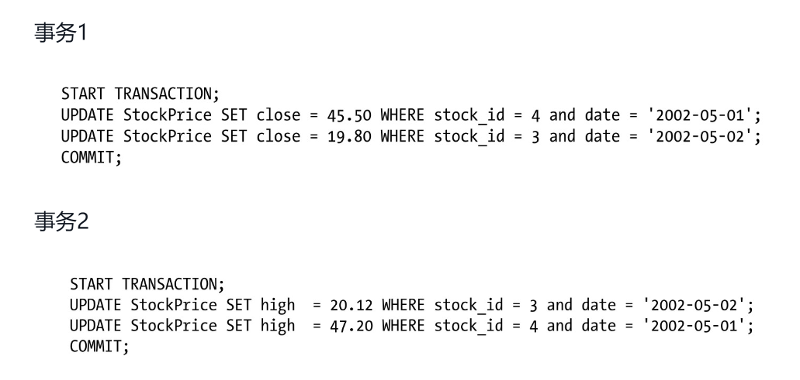

# 1. MySQL的架构

## 1.1 MySQL逻辑架构

## 1.2 并发控制

本章的目的是讨论MySQL在两个层面的并发控制：服务器层与存储引擎层。

**读写锁**

一个client在读取一行数据，另一个client想删除这个客户端正在读取的数据。

解决这类经典问题的方法就是并发控制，其实非常简单。在处理并发读或者写时，可以通过实现一个由两种类型的锁组成的锁系统来解决问题。这两种类型的锁通常被称为共享锁(shared lock)和排他锁(exclusive lock)，也叫读锁(read lock)和写锁(write lock)。

读锁是共享的，或者说是相互不阻塞的。多个客户在同一时刻可以同时读取同一个资源，而互不干扰。写锁则是排他的，也就是说一个写锁会阻塞其他的写锁和读锁。

**锁的粒度**

一种提高共享资源并发性的方式就是让锁定对象更有选择性。尽量只锁定需要修改的部分数据，而不是所有的资源。更理想的方式是，只对会修改的数据片进行精确的锁定。

问题是加锁也需要消耗资源。锁的各种操作，包括获得锁、检查锁是否已经解除、释放锁等，都会增加系统的开销。

所谓的锁策略，就是在锁的开销和数据的安全性之间寻求平衡，这种平衡当然也会影响到性能。

**表锁 table lock**

表锁是MySQL中最基本的锁策略，并且是开销最小的策略。

一个用户在对表进行写操作（插入、删除、更新等）前，需要先获得写锁，这会阻塞其他用户对该表的所有读写操作。

只有没有写锁时，其他读取的用户才能获得读锁，读锁之间是不相互阻塞的。

写锁也比读锁有更高的优先级.

**行锁 row lock**

行级锁只在存储引擎层实现.

## 1.3 事务 Transaction

MYSQL设置和读取隔离级别：

| Syntax                                               | Affected Characteristic Scope |
| :--------------------------------------------------- | :---------------------------- |
| `SET GLOBAL TRANSACTION transaction_characteristic`  | Global                        |
| `SET SESSION TRANSACTION transaction_characteristic` | Session                       |
| `SET TRANSACTION transaction_characteristic`         | Next transaction only         |

读取当前session的隔离级别：

```MYSQL
SELECT @@GLOBAL.transaction_isolation, @@GLOBAL.transaction_read_only;
SELECT @@SESSION.transaction_isolation, @@SESSION.transaction_read_only;

-- 设置隔离级别
SET [SESSION | GLOBAL] TRANSACTION ISOLATION LEVEL {READ UNCOMMITTED | READ COMMITTED | REPEATABLE READ | SERIALIZABLE}
```

事务的四个特性：ACID

- 原子性(atomicity)
- 一致性(consistency)：数据库总是从一个一致性的状态转换到另外一个一致性的状态。
- 隔离性(isolation)：通常来说，一个事务所做的修改在最终提交以前，对其他事务是不可见的。
- 持久性(durability)：一旦事务提交，则其所做的修改就会永久保存到数据库中。

即使存储引擎不支持事务，也可以通过`LOCK TABLES`语句为应用提供一定程度的保护，这些选择用户都可以自主决定。

### 1.3.1 隔离级别

事务可以读取未提交的数据，这也被称为脏读(Dirty Read)

幻读， 指的是当某个事务在读取某个范围内的记录时，另外一个事务又在该范围内插入了新的记录，当之前的事务再次读取该范围的记录时，会产生幻行(Phantom Row)。

在SQL标准中定义了四种隔离级别，每一种级别都规定了一个事务中所做的修改，哪些在事务内和事务间是可见的，哪些是不可见的。较低级别的隔离通常可以执行更高的并发，系统的开销也更低。

- READ UNCOMMITTED（未提交读）：事务中的修改，即使没有提交，对其他事务也都是可见的。
- READ COMMITTED（提交读）：一个事务开始时，只能“看见”已经提交的事务所做的修改。换句话说，一个事务从开始直到提交之前，所做的任何修改对其他事务都是不可见的。这个级别有时候也叫做不可重复读(nonrepeatable read)，因为两次执行同样的查询，可能会得到不一样的结果。
- REPEATABLE READ（可重复读）：该级别保证了在同一个事务中多次读取同样记录的结果是一致的。
- SERIALIZABLE（可串行化）：它通过强制事务串行执行，避免了前面说的幻读的问题。

### 1.3.2 死锁

死锁是指两个或者多个事务在同一资源上相互占用，并请求锁定对方占用的资源，从而导致恶性循环的现象。



### 1.3.3 事务日志

使用事务日志，存储引擎在修改表的数据时只需要修改其内存拷贝，再把该修改行为记录到持久在硬盘上的事务日志中，而不用每次都将修改的数据本身持久到磁盘。

### 1.3.4 MYSQL事务

**自动提交**

**隐式和显式锁定**

InnoDB采用的是两阶段锁定协议(two-phase locking protocol)。在事务执行过程中，随时都可以执行锁定，锁只有在执行COMMIT或者ROLLBACK的时候才会释放，并且所有的锁是在同一时刻被释放。前面描述的锁定都是隐式锁定，InnoDB会根据隔离级别在需要的时候自动加锁。

显式锁定：

```MYSQL
SELECT ... LOCK IN SHARE MODE
SELECT ... FOR UPDATE
```

MySQL也支持LOCK TABLES和UNLOCK TABLES语句，这是在服务器层实现的，和存储引擎无关。

## 1.4 MVCC 多版本并发控制

可以认为MVCC是行级锁的一个变种，但是它在很多情况下避免了加锁操作，因此开销更低。

MVCC的实现，是通过保存数据在某个时间点的快照来实现的。

InnoDB的MVCC，是通过在每行记录后面保存两个隐藏的列来实现的。这两个列，一个保存了行的创建时间，一个保存行的过期时间（或删除时间）。

下面看一下在REPEATABLE READ隔离级别下，MVCC具体是如何操作的。

**SELECT**

InnoDB只查找版本早于当前事务版本的数据行

行的删除版本要么未定义，要么大于当前事务版本号。

**INSERT**

InnoDB为新插入的每一行保存当前系统版本号作为行版本号。

**DELETE**

InnoDB为删除的每一行保存当前系统版本号作为行删除标识。

**UPDATE**

InnoDB为插入一行新记录，保存当前系统版本号作为行版本号，同时保存当前系统版本号到原来的行作为行删除标识。

MVCC只在REPEATABLE READ和READ COMMITTED两个隔离级别下工作。

## 1.5 MySQL的存储引擎

InnoDB next-key lock ????

[MySQL :: MySQL 8.0 Reference Manual :: 15.7 InnoDB Locking and Transaction Model](https://dev.mysql.com/doc/refman/8.0/en/innodb-locking-transaction-model.html)

```mysql
SHOW TABLE STATUS LIKE '';

mysql> show table status like 'teams' \G
*************************** 1. row ***************************
           Name: teams
         Engine: InnoDB
        Version: 10
     Row_format: Dynamic
           Rows: 12
 Avg_row_length: 1365
    Data_length: 16384
Max_data_length: 0
   Index_length: 0
      Data_free: 0
 Auto_increment: NULL
    Create_time: 2023-07-21 16:52:09
    Update_time: 2023-07-25 09:50:18
     Check_time: NULL
      Collation: utf8mb4_general_ci
       Checksum: NULL
 Create_options:
        Comment:
1 row in set (0.00 sec)
```

InnoDB采用MVCC来支持高并发，并且实现了四个标准的隔离级别。

其默认级别是REPEATABLE READ（可重复读），并且通过间隙锁(next-key locking)策略防止幻读的出现。间隙锁使得InnoDB不仅仅锁定查询涉及的行，还会对索引中的间隙进行锁定，以防止幻影行的插入。

