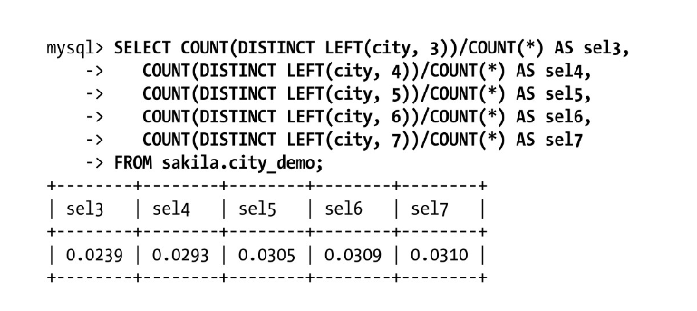

# 5 索引

## 5.1 索引基础

### 5.1.1 索引的类型

**B-tree索引。**

B-Tree通常意味着所有的值都是按顺序存储的，并且每一个叶子页到根的距离相同。

B-Tree对索引列是顺序组织存储的，所以很适合查找范围数据。

B-Tree索引适用于全键值、键值范围或键前缀查找。其中键前缀查找只适用于根据最左前缀的查找。

假如有如下的数据表：

```mysql
create table People (
	last_name varchar(50) not null,
    first_name varchar(50) not null,
    dob        date not null,
    gender     enum('m', 'f') not null,
    key(last_name, first_name, dob)
);
```

那么下面的情况可以使用B-Tree索引：

- 全值匹配：和索引中的所有列进行匹配，例如前面提到的索引可用于查找姓名为Cuba Allen、出生于1960-01-01的人。
- 匹配最左前缀：可用于查找所有姓为Allen的人，即只使用索引的第一列
- 匹配列前缀：只匹配某一列的值的开头部分。例如前面提到的索引可用于查找所有以J开头的姓的人。
- 匹配范围值：可用于查找姓在Allen和Barrymore之间的人。这里也只使用了索引的第一列。
- 精确匹配某一列并范围匹配另外一列：可用于查找所有姓为Allen，并且名字是字母K开头（比如Kim、Karl等）的人。
- 只访问索引的查询：即查询只需要访问索引，而无须访问数据行。

因为索引树中的节点是有序的，所以除了按值查找之外，索引还可以用于查询中的ORDER BY操作（按顺序查找）。

下面是一些关于B-Tree索引的限制：

- 如果不是按照索引的最左列开始查找，则无法使用索引。
- 不能跳过索引中的列。也就是说，前面所述的索引无法用于查找姓为Smith并且在某个特定日期出生的人。如果不指定名(first_name)，则MySQL只能使用索引的第一列。
- 如果查询中有某个列的范围查询，则其右边所有列都无法使用索引优化查找。

**哈希索引**

哈希索引(hash index)基于哈希表实现，只有精确匹配索引所有列的查询才有效[插图]。

因为索引自身只需存储对应的哈希值，所以索引的结构十分紧凑，这也让哈希索引查找的速度非常快。然而，哈希索引也有它的限制：

- 哈希索引只包含哈希值和行指针，而不存储字段值，所以不能使用索引中的值来避免读取行。
- 哈希索引数据并不是按照索引值顺序存储的，所以也就无法用于排序。
- 哈希索引也不支持部分索引列匹配查找，因为哈希索引始终是使用索引列的全部内容来计算哈希值的。
- 哈希索引只支持等值比较查询
- 访问哈希索引的数据非常快，除非有很多哈希冲突（不同的索引列值却有相同的哈希值）。当出现哈希冲突的时候，存储引擎必须遍历链表中所有的行指针，逐行进行比较，直到找到所有符合条件的行。

InnoDB引擎有一个特殊的功能叫做“自适应哈希索引(adaptive hash index)”。当InnoDB注意到某些索引值被使用得非常频繁时，它会在内存中基于B-Tree索引之上再创建一个哈希索引，这样就让B-Tree索引也具有哈希索引的一些优点，比如快速的哈希查找。

A)创建自定义的哈希索引。

```mysql
# 下面是一个实例，例如需要存储大量的URL，并需要根据URL进行搜索查找。如果使用B-Tree来存储URL，存储的内容就会很大，因为URL本身都很长。
select id from url where url="http://xxxxxxxx.com" 
# 若删除原来URL列上的索引，而新增一个被索引的url_crc列，使用CRC32做哈希，就可以使用下面的方式查询：
select id from url where url="http://xxxxxxxx.com" and url_crc=CRC32("http://xxxxxxxx.com")

# 这样做的性能会非常高，因为MySQL优化器会使用这个选择性很高而体积很小的基于url_crc列的索引来完成查找

# 这样实现的缺陷是需要维护哈希值。可以手动维护，也可以使用触发器实现。

create table pseudohash (
	id int,
    url varchar(255) not null,
    url_crc int unsigned not null default 0,
    primary key(id)
);

delimiter //

create trigger pseudohash_crc_ins before insert on pseudohash for each row begin
set new.url_crc=crc32(NEW.url);
END;
//

delimiter //

create trigger pseudohash_crc_ins before update on pseudohash for each row begin
set new.url_crc=crc32(NEW.url);
END;
//

# 如果数据表非常大，CRC32()会出现大量的哈希冲突，则可以考虑自己实现一个简单的64位哈希函数。
```

B)处理哈希冲突。当使用哈希索引进行查询的时候，必须在WHERE子句中包含常量值：

```mysql
select id from url where url="http://xxxxxxxx.com" and url_crc=CRC32("http://xxxxxxxx.com")
```

CRC32()返回的是32位的整数，当索引有93 000条记录时出现冲突的概率是1%。

**空间数据索引 R-tree**

**全文索引**

全文索引是一种特殊类型的索引，它查找的是文本中的关键词，而不是直接比较索引中的值。

在相同的列上同时创建全文索引和基于值的B-Tree索引不会有冲突，全文索引适用于MATCH AGAINST操作，而不是普通的WHERE条件操作。

## 5.2 索引的优点

最常见的B-Tree索引，按照顺序存储数据，所以MySQL可以用来做ORDER BY和GROUP BY操作。因为数据是有序的，所以B-Tree也就会将相关的列值都存储在一起。最后，因为索引中存储了实际的列值，所以某些查询只使用索引就能够完成全部查询。

## 5.3 高性能的索引策略

### 5.3.1 独立的列

如果查询中的列不是独立的，则MySQL就不会使用索引。“独立的列”是指索引列不能是表达式的一部分，也不能是函数的参数。

### 5.3.2 前缀索引和索引选择性

有时候需要索引很长的字符列：

通常可以索引开始的部分字符，这样可以大大节约索引空间，从而提高索引效率。

但这样也会降低索引的选择性。索引的选择性是指，不重复的索引值（也称为基数， cardinality）和数据表的记录总数(#T)的比值，范围从1/#T到1之间。索引的选择性越高则查询效率越高，因为选择性高的索引可以让MySQL在查找时过滤掉更多的行。唯一索引的选择性是1，这是最好的索引选择性，性能也是最好的。

为了决定前缀的合适长度，需要找到最常见的值的列表，然后和最常见的前缀列表进行比较。

首先，我们找到最常见的城市列表：

```mysql
select count(*) as cnt, city from city_demo group by city order by cnt desc limit 10
```

现在查找到最频繁出现的城市前缀，先从3个前缀字母开始：

```mysql
select count(*) as cnt, left(city, 3) as pref from city_demo group by pref order by cnt desc limit 10
```

计算合适的前缀长度的另外一个办法就是计算完整列的选择性，并使前缀的选择性接近于完整列的选择性。下面显示如何计算完整列的选择性：

```mysql
select count(distinct city) / count(*) from city_demo;
```



在上面的示例中，已经找到了合适的前缀长度，下面演示一下如何创建前缀索引：

```mysql
alter table city_demo add key (city(7));
```

前缀索引是一种能使索引更小、更快的有效办法，但另一方面也有其缺点：MySQL无法使用前缀索引做ORDER BY和GROUP BY，也无法使用前缀索引做覆盖扫描。

### 5.3.3 多列索引

很多人对多列索引的理解都不够。一个常见的错误就是，为每个列创建独立的索引，或者按照错误的顺序创建多列索引。

mysql 有一种叫 索引合并 的策略。

例如，表film_actor在字段film_id和actor_id上各有一个单列索引。但对于下面这个查询WHERE条件，这两个单列索引都不是好的选择：

```mysql
select film_id, actor_id from film_actor where actor_id = 1 or film_id = 1; 
```

在旧的MySQL版本中以上查询会全表扫描，可以改为使用 UNION的方式：

```mysql
select film_id, actor_id from film_actor where actor_id = 1 UNION
select film_id, actor_id from film_actor where film_id = 1; 
```

但在MySQL 5.0和更新的版本中，查询能够同时使用这两个单列索引进行扫描，并将结果进行合并。这种算法有三个变种：OR条件的联合(union),AND条件的相交(intersection)，组合前两种情况的联合及相交。

```
*************************** 1. row ***************************
           id: 1
  select_type: SIMPLE
        table: film_actor
   partitions: NULL
         type: index_merge
possible_keys: PRIMARY,idx_fk_film_id
          key: idx_fk_film_id,PRIMARY
      key_len: 2,2
          ref: NULL
         rows: 29
     filtered: 100
        Extra: Using union(idx_fk_film_id,PRIMARY); Using where
1 row in set, 1 warning (0.0012 sec)
```

索引合并策略有时候是一种优化的结果，但实际上更多时候说明了表上的索引建得很糟糕。

如果在EXPLAIN中看到有索引合并，应该好好检查一下查询和表的结构，看是不是已经是最优的。也可以通过参数`optimizer_switch`来关闭索引合并功能。也可以使用`IGNORE INDEX`提示让优化器忽略掉某些索引。

### 5.4.3 选择合适的索引列顺序

MYSQL的覆盖索引：[MySQL 覆盖索引详解 - 掘金 (juejin.cn)](https://juejin.cn/post/6844903967365791752)

我们遇到的最容易引起困惑的问题就是索引列的顺序。正确的顺序依赖于使用该索引的查询，并且同时需要考虑如何更好地满足排序和分组的需要。

在一个多列B-Tree索引中，索引列的顺序意味着索引首先按照最左列进行排序，其次是第二列，等等。

当不需要考虑排序和分组时，将选择性最高的列放在前面通常是很好的。这时候索引的作用只是用于优化WHERE条件的查找。然而，性能不只是依赖于所有索引列的选择性（整体基数），也和查询条件的具体值有关，也就是和值的分布有关。

当使用前缀索引的时候，在某些条件值的基数比正常值高的时候，问题就来了。例如，在某些应用程序中，对于没有登录的用户，都将其用户名记录为“guset”，在记录用户行为的会话(session)表和其他记录用户活动的表中“guest”就成为了一个特殊用户ID。

### 5.3.5 聚簇索引

1. 主键索引： 主键索引是一种唯一性索引，它用于标识表中的每一行数据，并确保每个主键值的唯一性。主键索引通常是表中的一个列，它可以是由用户定义，也可以是由系统自动生成（例如，自增列）。 主键索引包含索引数据和对应的行数据。这意味着主键索引本身就是一个树状结构，其中每个节点都包含索引键值和对应的行数据的引用。
1. 第二索引（辅助索引）： 第二索引是用于加速查询的非主键索引。与主键索引不同，第二索引的叶子节点中只包含索引键值和一个指向对应行数据的主键值。在使用第二索引进行查询时，数据库会首先查找第二索引，然后使用找到的主键值从主键索引中获取实际的行数据。

通过二级索引查找行，存储引擎需要找到二级索引的叶子节点获得对应的主键值，然后根据这个值去聚簇索引中查找到对应的行。这里做了重复的工作：两次B-Tree查找而不是一次

聚簇索引并不是一种单独的索引类型，而是一种数据存储方式。InnoDB的聚簇索引实际上在同一个结构中保存了B-Tree索引和数据行。

因为无法同时把数据行存放在两个不同的地方，所以一个表只能有一个聚簇索引，InnoDB将通过主键聚集数据。

`OPTIMIZE TABLE`： 

1. **碎片整理：** 在表进行大量的插入、更新和删除操作时，可能会导致表中存在碎片化的空间。这些碎片化的空间可能导致查询性能下降，因为数据库引擎需要更多的磁盘读取操作来获取数据。`OPTIMIZE TABLE` 将重新组织表的物理存储，消除碎片，使数据在磁盘上更加连续，从而提高查询性能。
1. **索引优化：** 在某些情况下，索引也可能变得不连续，影响查询性能。`OPTIMIZE TABLE` 会对表的索引进行优化，使得索引的存储更加紧凑，减少磁盘访问次数。
1. **重建表统计信息：** 数据库引擎使用统计信息来优化查询执行计划，以确定最有效的查询路径。`OPTIMIZE TABLE` 也会更新表的统计信息，确保数据库引擎有准确的信息来选择最优的查询计划。

### 5.3.6 覆盖索引

如果一个索引包含（或者说覆盖）所有需要查询的字段的值，我们就称之为“覆盖索引”。

由于InnoDB的聚簇索引，覆盖索引对InnoDB表特别有用。InnoDB的二级索引在叶子节点中保存了行的主键值，所以如果二级主键能够覆盖查询，则可以避免对主键索引的二次查询。

当发起一个被索引覆盖的查询（也叫做索引覆盖查询）时，在EXPLAIN的Extra列可以看到“Using index”的信息。

```
*************************** 1. row ***************************
           id: 1
  select_type: SIMPLE
        table: inventory
   partitions: NULL
         type: index
possible_keys: NULL
          key: idx_store_id_film_id
      key_len: 3
          ref: NULL
         rows: 4581
     filtered: 100
        Extra: Using index
1 row in set, 1 warning (0.0114 sec)
```

